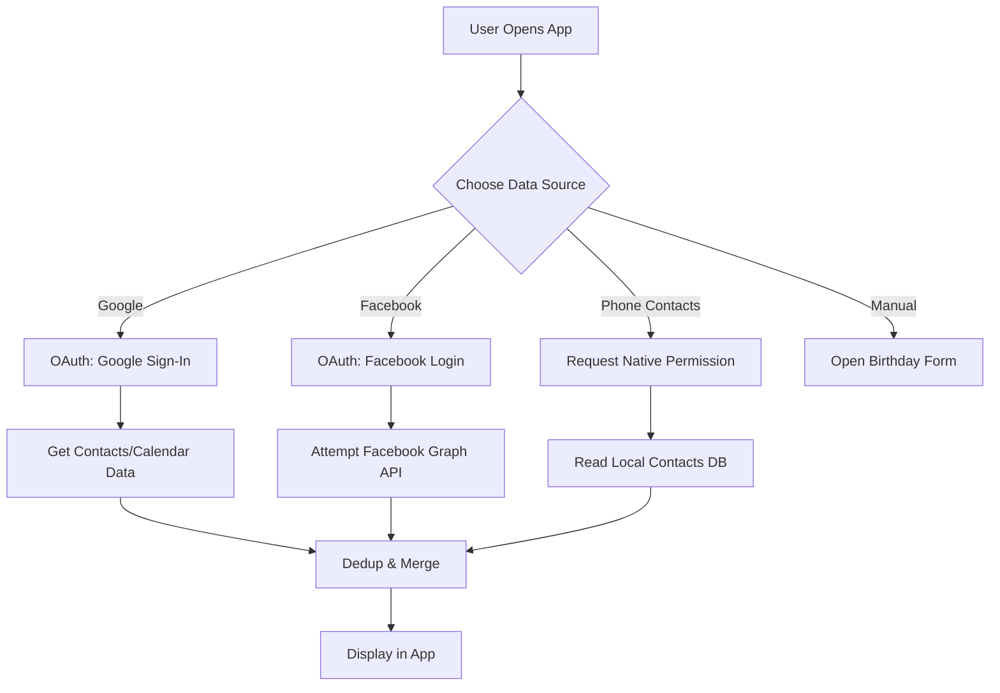

# API Feasibility Analysis for Birthday Bot

## Overview

This document analyzes the technical feasibility of importing birthday data from various sources for the Birthday Bot.

## Data Source Analysis

### 1. Facebook

**Feasibility**: ⚠️ **Limited**

**How it Works**:
- Users authenticate via OAuth
- App gets `user_friends` permission and birthday data
- Birthdays stored in Facebook friends' profiles

**Limitations**:
- Meta restricts third-party apps from accessing detailed friends' data
- Birthday endpoint requires specific approval from Meta
- Rate limits and request quotas apply
- Privacy restrictions: Can't bulk-fetch all friends' birthdays without each friend authorizing the app

**Workaround**:
- Request users to authenticate once
- Attempt to fetch via Graph API endpoint `/me/friends?fields=birthday`
- If Meta declines, provide browser extension as alternative

**Cost**: Free API tier available, but limited requests

**Status**: Possible but requiring Meta app review and approval

---

### 2. Instagram

**Feasibility**: ❌ **Not Possible** (Official API)

**Why**:
- Instagram's official Graph API has **no endpoint for birthday data**
- Even for Business/Creator accounts, birthdays cannot be fetched
- Personal profile data is protected under Instagram's privacy policy
- Cannot access follower/following birthday information via API

**Workarounds**:
- **Browser Extension**: Capture visible birthday data when user views their own followers (manual scraping)
- **Manual Entry**: Ask users to add Instagram friends' birthdays manually
- **QR Code**: Generate birthday shareable links within app that friends can add

**Recommendation**:
- Don't attempt official Instagram integration
- Offer browser extension as optional add-on for tech-savvy users
- Primary focus: manual entry and other sources

---

### 3. Google Contacts

**Feasibility**: ✅ **Fully Supported**

**How it Works**:
- Use Google People API
- Endpoint: `people.connections.list()`
- Returns contacts with birthday field populated

**Permissions Required**:
- `contacts.readonly` scope
- User must authorize via OAuth

**Advantages**:
- Widely used, most people have Google Contacts
- Reliable API with good documentation
- Handles conflict resolution elegantly
- Syncs cross-device

**Code Example**:
```
GET https://people.googleapis.com/v1/people/me/connections?personFields=names,emailAddresses,birthdays&pageSize=1000
Headers: Authorization: Bearer {accessToken}
```

**Cost**: Free (within quota limits, ~1M requests/day)

**Status**: ✅ **Recommended - Priority 1**

---

### 4. Apple Contacts (iOS)

**Feasibility**: ✅ **Fully Supported** (Native)

**How it Works**:
- Use `Contacts` framework (native iOS)
- Access phone's local contacts database
- Birthday stored in `CNContact.birthday`

**Permissions Required**:
- `NSContactsUsageDescription` in Info.plist
- User grants permission at runtime

**Advantages**:
- Offline access, no API call needed
- All contacts stored locally
- Fastest access

**Code Example** (SwiftUI):
```swift
import Contacts

let store = CNContactStore()
store.requestAccess(for: .contacts) { granted, error in
    if granted {
        let keys = [CNContactGivenNameKey, CNContactFamilyNameKey,
                   CNContactBirthdayKey] as [CNKeyDescriptor]
        let request = CNContactFetchRequest(keysToFetch: keys)
        do {
            try store.enumerateContacts(with: request) { contact in
                if let birthday = contact.birthday {
                    // Process birthday
                }
            }
        } catch {
            // Handle error
        }
    }
}
```

**Cost**: Free (local device access)

**Status**: ✅ **Recommended - Priority 1**

---

### 5. Android Contacts

**Feasibility**: ✅ **Fully Supported** (Native)

**How it Works**:
- Use `ContactsProvider` content provider
- Query Contacts database
- Birthday stored in common data table

**Permissions Required**:
- `READ_CONTACTS` in AndroidManifest.xml
- Runtime permission at install/runtime

**Advantages**:
- Offline access
- Comprehensive contact data
- Works on all Android versions

**Code Example** (Kotlin):
```kotlin
import android.provider.ContactsContract

val projection = arrayOf(
    ContactsContract.CommonDataKinds.Event.CONTACT_ID,
    ContactsContract.CommonDataKinds.Event.START_DATE,
    ContactsContract.CommonDataKinds.Event.TYPE
)
val selection = "${ContactsContract.CommonDataKinds.Event.TYPE} = ?"
val selectionArgs = arrayOf(
    ContactsContract.CommonDataKinds.Event.TYPE_BIRTHDAY.toString()
)

val cursor = contentResolver.query(
    ContactsContract.Data.CONTENT_URI,
    projection,
    selection,
    selectionArgs,
    null
)

cursor?.use {
    while (it.moveToNext()) {
        val birthDate = it.getString(it.getColumnIndex(
            ContactsContract.CommonDataKinds.Event.START_DATE
        ))
        // Process birthday
    }
}
```

**Cost**: Free (local device access)

**Status**: ✅ **Recommended - Priority 1**

---

### 6. Google Calendar

**Feasibility**: ✅ **Fully Supported**

**How it Works**:
- Use Google Calendar API
- Create or read "Birthdays" calendar
- Recurring all-day events for birthdays

**Permissions Required**:
- `calendar` scope (read/write)

**Advantages**:
- Structured calendar events
- Easy to share across devices
- Natural integration with calendar apps

**Code Example**:
```
GET https://www.googleapis.com/calendar/v3/calendars/primary/events
?q=birthday&pageSize=2500
Headers: Authorization: Bearer {accessToken}
```

**Cost**: Free (within quota limits)

**Status**: ✅ **Recommended - Priority 1**

---

### 7. Outlook Calendar

**Feasibility**: ⚠️ **Partial Support**

**How it Works**:
- Use Microsoft Graph API
- Similar to Google Calendar
- Events endpoint

**Permissions Required**:
- `Calendars.Read` or `Calendars.Read.Shared`

**Limitations**:
- Less common than Google Calendar
- API is more complex

**Status**: ⏸️ **Recommended for Phase 2**

---

### 8. WhatsApp / Telegram

**Feasibility**: ❌ **Not Supported** (No official API)

**Why**:
- WhatsApp has restricted API (businesses only)
- Telegram has no birthday data in official API
- Privacy-focused, no third-party data export

**Workaround**:
- Offer manual birthday sharing via shareable links
- Users can share birthday via bot commands

**Status**: ❌ **Not recommended**

---

## Recommended Integration Strategy

### Priority 1 (MVP - Do First):
1. ✅ **Phone Contacts** (iOS native + Android native)
2. ✅ **Google Contacts** (OAuth, Google People API)
3. ✅ **Google Calendar** (OAuth, Google Calendar API)
4. ✅ **Manual Entry** (Web dashboard + mobile forms)

### Priority 2 (Post-MVP):
1. ⚠️ **Facebook** (If Meta approves, otherwise skip)
2. ⏸️ **Outlook Calendar** (Microsoft Graph API)
3. 📱 **Browser Extension** (Instagram workaround for tech-savvy users)

### Don't Do:
1. ❌ **Direct Instagram API** (No official endpoint)
2. ❌ **WhatsApp/Telegram API** (Not designed for this)
3. ❌ **LinkedIn API** (Privacy-focused, no birthday endpoint)

## Authentication Flow



## Data Deduplication Strategy

When importing from multiple sources, handle duplicates by:

1. **Exact Match**: Same name + same birthdate → Merge automatically
2. **Fuzzy Match**: Similar names (Levenshtein distance < 2) + same birthdate → Ask user
3. **Partial Match**: Same name, different dates → Flag conflict, ask user
4. **Manual Resolution**: User can mark "Don't merge" to keep separate records

**Recommended Library**: `fuzzywuzzy` (Python) or `string-similarity` (JavaScript)

---

## Cost Estimation

| Source | Cost | Notes |
|--------|------|-------|
| Google APIs | Free (quota: 1M/day) | Generous free tier |
| Phone Contacts | Free | Native, no API calls |
| Facebook | Free (with approval) | Subject to rate limits |
| Manual Entry | Free | Basic server costs |

**Monthly Server Cost Estimate (1000 users)**:
- Database: $50-100 (PostgreSQL)
- API hosting: $50-200 (Node.js/Python)
- SMS notifications: $0.01-0.05 per message (premium feature)
- Notifications: $0-50 (Firebase free tier, or costs if high volume)

---

## Conclusion

**Feasibility**: ✅ **MVP is feasible**

**Recommendation**:
1. Start with phone contacts + Google integrations (Phase 1)
2. Add Facebook as Phase 2 (pending Meta approval)
3. Skip Instagram official API, offer browser extension alternative
4. Plan for manual entry as primary fallback

**Timeline**: 4-6 weeks to MVP with Priority 1 integrations
