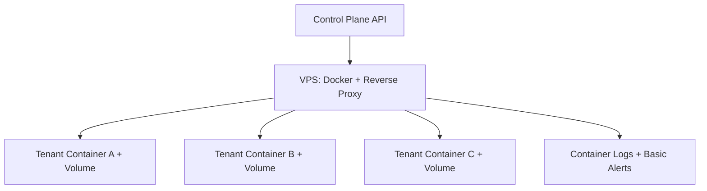
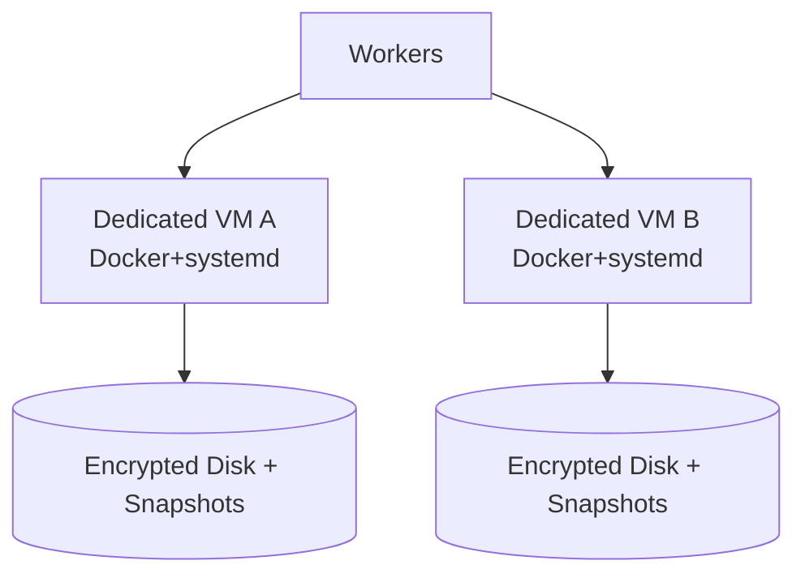
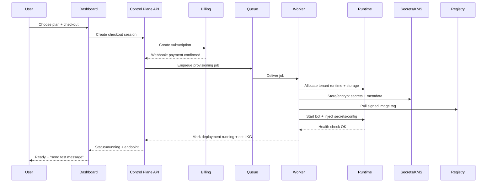
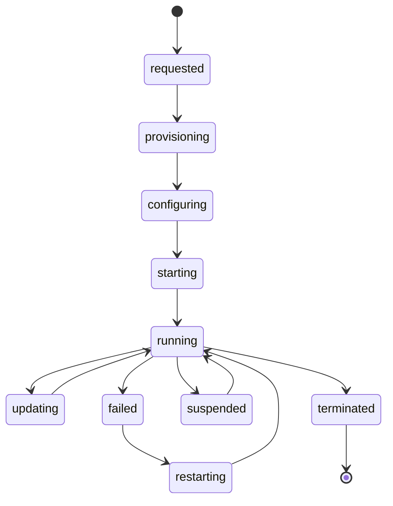
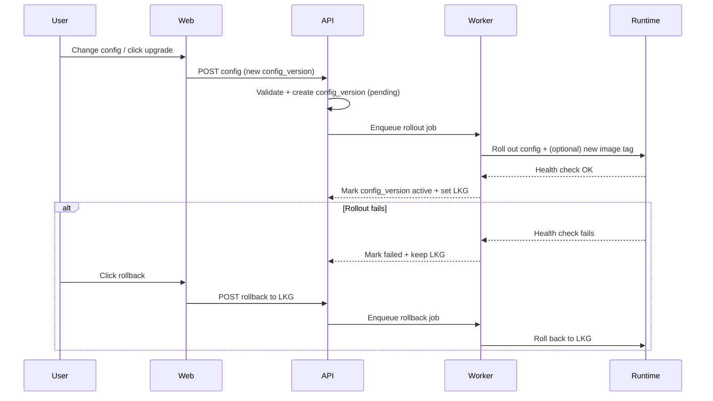
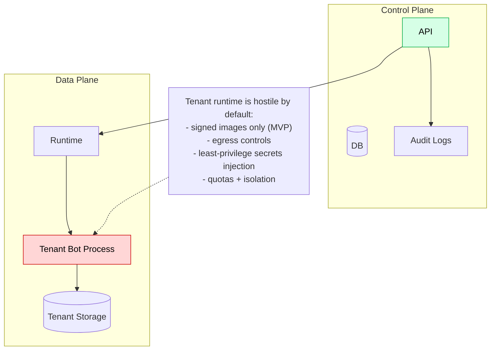

# Launchpad Architecture Diagrams (Human-Friendly)

**Last Updated**: Feb 8, 2026

These diagrams explain how **Clawdbot Launchpad** is built and how it works at a high level. They are intentionally **implementation-agnostic**, but map cleanly to the current PRD/SPEC/TASKS.

## If you can’t see the diagrams

Some markdown viewers don’t render Mermaid (` ```mermaid `) and will show only the diagram source code.

- **Best viewer**: GitHub file view usually renders Mermaid automatically.
- **Fallback**: use the ASCII “picture” blocks below (and/or paste the Mermaid blocks into the [Mermaid Live Editor](https://mermaid.live/)).

## 1) System Overview (Control Plane vs Data Plane)

### 1a) ASCII overview (fallback)

```text
                ┌─────────────────────────── Control Plane (SaaS) ───────────────────────────┐
User/Browser →  │  Web/Dashboard → API → DB                                                 │
                │                    │                                                       │
                │                    ├→ Billing (webhooks)                                   │
                │                    ├→ Provisioning Queue → Workers                         │
                │                    └→ Audit Logs                                            │
                └─────────────────────────────────────────────────────────────────────────────┘

                                   Workers drive lifecycle actions

                ┌────────────────────────── Data Plane (Customer Runtime) ───────────────────┐
                │  Orchestrator/VPS Fleet → Tenant Bot Process → Tenant Volume/Storage        │
                │                │                    │                                       │
                │                ├→ Signed Images      ├→ Secrets injection (KMS/Secrets)     │
                │                └→ Logs/Metrics       └→ Egress controls + quotas            │
                └─────────────────────────────────────────────────────────────────────────────┘
```

```mermaid
flowchart LR
  U[User] -->|Browser| WEB[Web App / Dashboard]
  WEB --> API[Control Plane API]
  API --> DB[(Postgres)]
  API --> BILLING[Billing Provider\n(e.g. Stripe)]
  BILLING -->|webhooks| API
  API --> Q[(Provisioning Queue)]
  Q --> W[Provisioning Workers]

  subgraph DataPlane[Data Plane (Customer Runtime)]
    RT[Runtime Orchestrator\n(ECS/K8s/Nomad or VPS fleet)]
    REG[Image Registry\n(signed images)]
    SEC[Secrets Manager / KMS]
    LOG[Logs/Metrics]
    PV[(Persistent Storage\n(volumes/snapshots))]
  end

  W --> RT
  W --> REG
  W --> SEC
  RT --> LOG
  RT --> PV

  API --> LOGA[Audit Logs]
```

**Key idea**:
- **Control plane** is multi-tenant SaaS logic: auth, billing, deployments, config versions, and audit trails.
- **Data plane** is where customer bots run: containers/VPS + storage + secrets injection + observability.

## 2) MVP Runtime Options (Pilot vs Managed MVP vs Phase 2)

### 2a) Pilot (single VPS, fast learning)



**When**: first 10–50 customers or concierge migration cohort.  
**Risk**: single point of failure + weaker multi-tenant isolation.

### 2b) Managed MVP (shared containers)

```mermaid
flowchart TB
  W[Workers] --> ORCH[Orchestrator\n(ECS/Fargate or managed K8s)]
  ORCH --> NS1[Tenant Namespace/Service A]
  ORCH --> NS2[Tenant Namespace/Service B]
  ORCH --> PV1[(Tenant PV A)]
  ORCH --> PV2[(Tenant PV B)]
  ORCH --> OBS[Central Logs/Metrics\n(per-tenant scoped)]
  ORCH --> NET[Network Policies / Egress Controls]
```

**Goal**: good unit economics + automated lifecycle + quotas + better isolation.

### 2c) Phase 2 (dedicated VPS tier)



**Goal**: strongest isolation + predictable performance for Team/enterprise tiers.

## 3) Provisioning Sequence (One-click deploy)

### 3a) ASCII provisioning sequence (fallback)

```text
User → Checkout → Billing webhook → Provisioning job queued → Worker allocates runtime/storage
  → secrets stored/encrypted → signed image pulled → bot started w/ config+secrets
  → health checks pass → deployment marked running + LKG set → user sees Ready + test action
```



## 4) Deployment State Machine (Lifecycle)



## 5) Configuration & Upgrade/Rollback (the moat UX)



## 6) Migration (Concierge + Self-serve)

```mermaid
flowchart LR
  A[Existing Self-hosted Bot] -->|Export config + data| I[Import Pipeline]
  A -->|Concierge access (temporary)| C[Concierge Migration]
  I --> D[Dry-run Deployment]
  C --> D
  D -->|Automated checks pass| CUT[Cutover]
  CUT -->|Keep old host warm| ROLLBACK[Rollback window]
  CUT --> RUN[Launchpad Running + Managed Upgrades]
```

## 7) Security Boundaries (what to keep strict in MVP)



## 8) Optional: Daytona for Ephemeral Workspaces (Non-Production)

```mermaid
flowchart LR
  API[Control Plane] --> Q[(Jobs)]
  Q --> W[Worker]
  W --> D[Daytona Workspace\n(ephemeral)]
  D --> A[Artifacts\n(SBOM/test logs)]
  A --> S3[(Object Storage)]
```

**Use cases**: image build/test sandboxes, support reproduction, untrusted plugin validation.  
**Non-goal**: hosting customer bots on Daytona unless a POC proves persistence + ingress + isolation + ops hooks.

