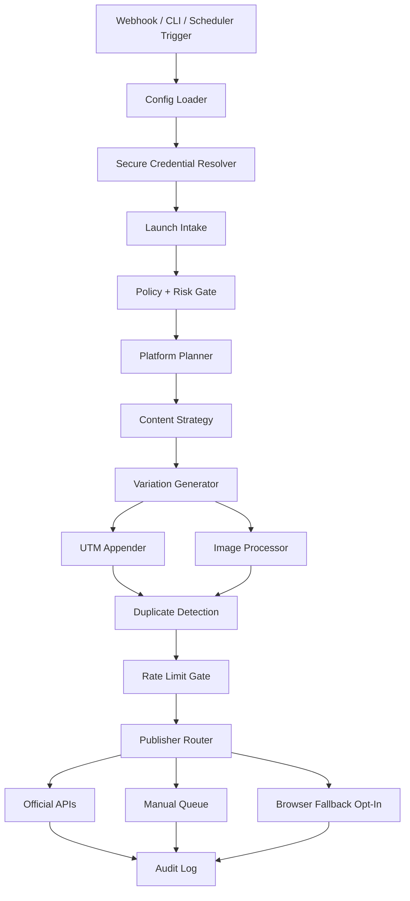

## Orbit Pilot Architecture Diagrams

### 1) Launch Orchestration Overview



### 2) Submission Mode Decision

```text
platform selected
   -> official write path confirmed?
      -> yes -> official_api
      -> no -> manual
         -> browser fallback enabled + allowlisted + accepted risk?
            -> yes -> browser_fallback_opt_in
            -> no -> stay manual
```

### 3) Data Flow

```text
LaunchProfile + PlatformRecord
   -> SubmissionDraft
      -> Duplicate + Cooldown Checks
         -> SubmissionDecision
            -> Attempt
               -> Result + AuditEvent
```
