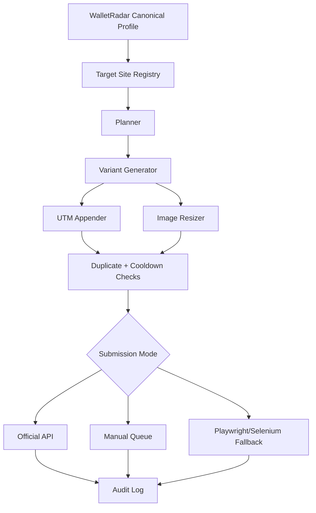

# WalletRadar Backlink Launch Orchestrator

**Status:** Idea / Spec Draft | **Last Updated:** March 23, 2026

## Problem Statement

WalletRadar already has strong on-site SEO work, but directory submissions, startup listings, product launch sites, and profile pages are still mostly manual. That creates three problems:

1. High friction: every site wants the same company facts in a slightly different format.
2. Low consistency: descriptions, screenshots, tags, and links drift over time.
3. Compliance risk: some sites allow APIs or structured submissions, others are clearly manual, and browser automation can cross policy lines fast.

The real goal is not "post everywhere." The goal is to get WalletRadar listed on relevant backlink sources safely, with high-quality submissions and a durable audit trail.

## Refined Scope

This is a **WalletRadar-specific launch assistant** for:

- startup directories
- product listing sites
- company profile sites
- software comparison directories
- launch communities
- niche backlink sources that accept real submissions

It is **not** primarily a social autoposter. Social posting can stay as a secondary extension later.

## Core Thesis

Build a manual-first, compliance-first submission system that:

1. stores WalletRadar's canonical company profile once,
2. generates site-specific submission variants,
3. appends UTM tags to every outbound link,
4. tracks submission status and duplicates,
5. uses official APIs where they exist,
6. defaults to manual mode when site support is unclear,
7. only allows Playwright/Selenium fallback as an explicit high-risk opt-in.

## Why This Matters For WalletRadar

WalletRadar is an index/research site. It benefits disproportionately from:

- niche referral traffic from wallet, crypto, startup, and tool directories
- entity validation across company/profile sites
- more branded mentions and backlinks
- more crawl paths into high-value comparison pages

This complements the existing [`wallets/SEO_IMPLEMENTATION.md`](../../wallets/SEO_IMPLEMENTATION.md) work instead of replacing it.

## Product Shape

### Inputs

- canonical WalletRadar profile:
  - name
  - URL
  - tagline
  - 50-word description
  - 160-word description
  - long company description
  - categories
  - founder/company metadata
  - logos and screenshots
- site registry:
  - site name
  - submit URL
  - official API status
  - required fields
  - moderation notes
  - risk level
  - status: queued, submitted, approved, rejected, live
- config:
  - enabled targets
  - risk tolerance
  - rate limits
  - whether browser fallback is allowed

### Outputs

- site-specific submission draft
- final tracked URL with UTM params
- asset pack resized to site requirements
- manual checklist or API publish result
- audit log entry

## Architecture Summary

## Submission Modes

### Low Risk

- official API
- official partner ingestion path
- official share flow

### Medium Risk

- manual submission through normal forms
- templated copy generation with human review

### High Risk

- browser automation for sites without reliable APIs
- only allowed if explicitly enabled
- must be labeled: `USE AT YOUR OWN RISK`

## First-Class Requirements

### 1. Canonical Profile Store

One source of truth for WalletRadar facts. No more rewriting the company description from scratch for every site.

### 2. Site Registry

Each site needs structured metadata:

- official URL
- category
- API/manual/unknown
- content rules
- nofollow/dofollow if known
- moderation latency
- credentials needed
- last submission date

### 3. Quality Variations

The system should produce:

- short blurb
- directory description
- founder-style launch summary
- comparison-site description
- crypto-native description

Each variation should be materially different, not just a synonym swap.

### 4. UTM Discipline

Every outbound WalletRadar URL should be normalized and tagged by source:

- `utm_source`
- `utm_medium`
- `utm_campaign`
- `utm_content`

### 5. Asset Pipeline

- resize logos and screenshots per site constraints
- compress without obvious quality loss
- keep alt text and filenames organized

### 6. Duplicate Detection

Prevent:

- resubmitting the same site
- reusing nearly identical text everywhere
- posting again during cooldown windows

### 7. Secure Credentials

Store tokens in OS-backed credential storage, not plaintext config.

### 8. Full Auditability

Track:

- what was submitted
- where
- when
- by which mode
- with which link variant
- final live URL if approved

## Recommended MVP

### Phase 1

- canonical WalletRadar profile YAML
- target site registry YAML/CSV
- content generator
- UTM appender
- manual submission queue
- approval tracker

### Phase 2

- official API integrations where available
- screenshot resizing pipeline
- duplicate detection and cooldowns
- webhook trigger from internal launch events

### Phase 3

- optional browser fallback for a narrow allowlist of sites
- analytics sync
- indexing checks after approval

## Suggested Initial Target Buckets

These should be filled from the previously shared backlink-site list, then normalized into the registry:

- startup/product launch sites
- AI tool directories
- crypto tool directories
- software discovery/comparison sites
- company profile databases
- founder/community launch boards

If a site's write support is uncertain, classify it as `manual` until verified.

## Operating Policy

- Default to manual mode when uncertain.
- Never bypass CAPTCHA or MFA.
- Never mass-submit identical copy.
- Never claim official support where only scraping or browser scripting exists.
- Keep the browser automation path disabled by default.

## Concrete Example For WalletRadar

Instead of a generic "multi-platform content engine," the orchestrator should do this:

1. Load WalletRadar's canonical facts.
2. Select a target like Crunchbase, Tiny Startups, Product Hunt, or a crypto directory.
3. Generate a site-native description with the right length and tone.
4. Attach the right logo or screenshot size.
5. Append UTM tags to `https://walletradar.org`.
6. Either:
   - submit via official API,
   - create a manual-ready draft, or
   - mark as high-risk fallback only.
7. Log the result and next action.

## Open Questions

- What exact backlink and directory list should seed the registry?
- Which sites matter most: authority, referral traffic, indexing speed, or niche relevance?
- Which sites allow company updates after approval?
- Which sites require founder identity versus company identity?
- Do we want one general tool, or a WalletRadar-only operator first?

## Recommended Next Step

Do one iteration focused purely on **WalletRadar backlink/directory submission ops**:

1. build the target-site registry from the previously shared list,
2. rank sites by value and risk,
3. define the canonical WalletRadar profile fields,
4. only then decide which APIs or automations are worth implementing.
