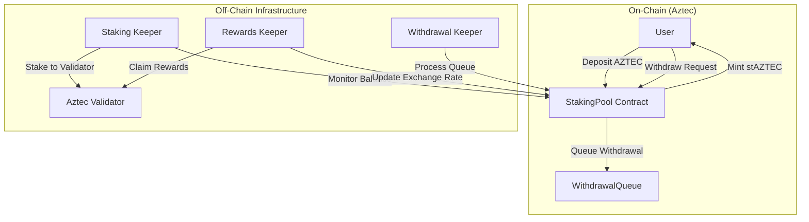

# System Architecture: Aztec Liquid Staking

**Last Updated:** December 27, 2025
**Status:** Draft

This document outlines the high-level architecture for the `stAZTEC` liquid staking protocol.

---

## 1. System Overview

The system consists of three main components:
1.  **On-Chain Contracts (Noir)**: Handles deposits, share accounting, and withdrawal queues.
2.  **Off-Chain Bots (TypeScript)**: Automates staking to validators, claiming rewards, and processing withdrawals.
3.  **Frontend Interface (Next.js)**: User-facing dashboard for interaction.

---

## 2. Smart Contracts (Noir)

Located in `staking/contracts/aztec-staking-pool`.

### 2.1 Core Contracts
*   **`StakingPool.nr`**: The main entry point.
    *   **State:** `total_staked`, `total_shares`, `exchange_rate`.
    *   **Functions:** `deposit()`, `withdraw()`, `add_rewards()`.
    *   **Dependencies:** Aztec Token Standard (for asset transfers).

### 2.2 Key Flows
*   **Deposit**: User sends AZTEC -> Contract calculates shares based on current rate -> Mints stAZTEC shares.
*   **Withdrawal**: User burns shares -> Contract calculates AZTEC amount -> Sends AZTEC (minus fees).

---

## 3. Bot Infrastructure

Located in `staking/aztec/bots`.

### 3.1 Design Pattern
*   **Monorepo**: TypeScript/Node.js using npm workspaces.
*   **Containerization**: Docker for each bot service.
*   **Coordination**: Redis (BullMQ) for job queues (optional but recommended for robustness).

### 3.2 Bot Responsibilities
1.  **Staking Keeper**:
    *   *Trigger*: Pool balance > 200,000 AZTEC.
    *   *Action*: Selects validator from registry, initiates stake transaction.
2.  **Rewards Keeper**:
    *   *Trigger*: Time-based (e.g., every epoch/6 mins).
    *   *Action*: Claims rewards from validators, calls `add_rewards()` on contract.
3.  **Withdrawal Keeper**:
    *   *Trigger*: Withdrawal queue non-empty.
    *   *Action*: Processes eligible withdrawals, unstakes from validators if liquid buffer is low.

---

## 4. Frontend Application

Located in `staking/aztec/frontend`.

*   **Framework**: Next.js 14 (App Router).
*   **Styling**: Tailwind CSS + ShadcnUI.
*   **State Management**: React Query (TanStack Query).
*   **Wallet Integration**: Aztec Wallet SDK (TBD based on availability).

---

## 5. Data Flow & State Management

1.  **Exchange Rate**: Updated only when `add_rewards()` is called (increasing value) or via slashing (decreasing value).
2.  **Share Calculation**: `shares = amount * total_shares / total_staked`.
3.  **Fees**: Protocol takes a cut (e.g., 10%) of *rewards* before adding them to `total_staked`.

---

## 6. Security Considerations

*   **Access Control**: Only `admin` can pause or change fees.
*   **Reentrancy**: Aztec's execution model differs from EVM, but state updates should precede external calls.
*   **Slashing**: Logic to handle validator slashing events without breaking the share price calculation (socialized loss).
