# 🚀 MASTER HANDOFF: Aztec Liquid Staking Protocol

> **FROM:** Acting CEO, COO, CMO, Director of Engineering
> **TO:** Next Lead Agent
> **DATE:** December 27, 2025
> **MISSION:** Execute Phase 2 (Contract Core) & Phase 3 (Bot Infra) simultaneously.

---

## 🏢 Executive Summary (The "Why")

We are building **stAZTEC**, the Lido of Aztec Network. The market is empty ($22M staked, 0 liquid). We have the first-mover advantage, but **Olla (competitor)** is breathing down our necks.

**Our Strategy:**
1.  **Speed:** Launch a public MVP first.
2.  **Safety:** Modular architecture with upgradeability (TimeLock).
3.  **Simplicity:** Self-hosted validators (vertical integration) to start, decentralized set later.

**Current Status:**
*   ✅ **Token:** `StakedAztecToken` (Ready)
*   ✅ **Queue:** `WithdrawalQueue` (Ready)
*   ✅ **Registry:** `ValidatorRegistry` (Ready)
*   ❌ **Brain:** `LiquidStakingCore` (Missing - Critical Path)
*   ❌ **Muscle:** `VaultManager` & Bots (Missing)

---

## 🏗️ Architectural Blueprint (The "What")

```mermaid
graph TD
    User((User))
    
    subgraph "On-Chain (Noir Contracts)"
        Core[LiquidStakingCore.nr]
        Token[StakedAztecToken.nr]
        Vault[VaultManager.nr]
        Rewards[RewardsManager.nr]
        Queue[WithdrawalQueue.nr]
        Registry[ValidatorRegistry.nr]
    end
    
    subgraph "Off-Chain (Bots/Keepers)"
        StakingBot[🤖 Staking Keeper]
        RewardsBot[🤖 Rewards Keeper]
        WithdrawBot[🤖 Withdrawal Keeper]
        MonitorBot[🤖 Sentry]
    end
    
    User -->|Deposit AZTEC| Core
    Core -->|Mint stAZTEC| Token
    Core -->|Accumulate| Vault
    
    StakingBot -->|Watch >200k| Vault
    Vault -->|Stake| Validator[Validator Node]
    
    Validator -->|Rewards| Rewards
    RewardsBot -->|Claim & Distribute| Rewards
    Rewards -->|Update Rate| Token
    
    User -->|Request Exit| Core
    Core -->|Queue Request| Queue
    WithdrawBot -->|Process Queue| Queue
```



---

## ⚠️ Critical Gaps Identified (Read `docs/ARCHITECTURE_GAPS.md`)

1.  **Upgradeability:** We must implement a "Registry Pattern" where `Core` looks up `Vault` and `Rewards` addresses. **Do not hardcode contract addresses.**
2.  **Insurance Fund:** `RewardsManager` must split fees: 50% to Insurance (until cap), 50% to Treasury.
3.  **Bot Interface:** We need a strictly defined `events.nr` file so bots don't crash on ABI changes.

---

## 🛠️ Specialized Prompt Tracks (The "How")

*Pick a track and execute. Do not try to do all at once.*

###  track_A: Smart Contract Core (Priority: CRITICAL)
**Goal:** Connect the limbs. Build `LiquidStakingCore.nr` and `VaultManager.nr`.

```text
You are the Lead Solidity/Noir Engineer.
Context: contracts/AGENT_HANDOFF.md, docs/ARCHITECTURE_GAPS.md

Task:
1. Implement `LiquidStakingCore.nr` (TASK-105/106/107).
   - CONSTRAINT: Use "Registry Pattern" for calling Vault/Rewards (upgradable).
   - CONSTRAINT: Implement `deposit` and `request_withdrawal`.
2. Implement `VaultManager.nr` (TASK-108).
   - CONSTRAINT: Batch stakes in 200k chunks.
   - CONSTRAINT: Round-robin validator selection from `ValidatorRegistry`.

Reference:
- `contracts/staked-aztec-token` (Already built, see how it's done)
- `contracts/staking-math-tests` (Use these for logic verification)
```

### track_B: Bot Infrastructure Specs
**Goal:** Define the "nervous system" before we code the brains.

```text
You are the Backend Architect.
Context: docs/IMPLEMENTATION-PLAN.md, docs/ARCHITECTURE_GAPS.md

Task:
1. Create `bots/specs/API_INTERFACE.md`.
   - Define the exact Event Signatures the contracts must emit.
   - Define the JSON RPC calls the bots will make.
2. Scaffold the Bot Repo `bots/`.
   - Create a shared `packages/common` for ABI parsing.
   - Create skeletons for `staking-keeper`, `rewards-keeper`, `withdrawal-keeper`.
   - Stack: TypeScript, Viem (or Aztec.js equivalent), BullMQ (Redis).
```

### track_C: Validator Operations (IaC)
**Goal:** Make deployment boring and reproducible.

```text
You are the DevOps Lead.
Context: docs/ASSUMPTIONS.md (Cost models)

Task:
1. Create `ops/validator-node/`.
2. Write a `docker-compose.yml` for a standard Aztec Validator.
3. Write a `README.md` in `ops/` explaining:
   - Key management (where do private keys live?).
   - Monitoring setup (Prometheus metrics to scrape).
   - Disaster recovery (what if a node dies?).
```

### track_D: Frontend Mockups
**Goal:** Show the users (and investors) what they are buying.

```text
You are the Product Designer.
Context: docs/EXECUTIVE-SUMMARY.md

Task:
1. Create `frontend/README.md` with a "User Flow" description.
2. Create `frontend/MOCKUPS.md` (ASCII wireframes) for:
   - Dashboard (TVL, APY, Your Stake).
   - Deposit Modal (AZTEC -> stAZTEC).
   - Unstake Flow (Queue position, time to unlock).
3. Define the "Data Requirements" for the frontend (what needs to be indexed?).
```

---

## ✅ Definition of Done (The Check)

1.  **Core Contract Compiles:** `LiquidStakingCore` builds without errors.
2.  **Integration Test Pass:** A script exists that simulates: Deposit -> 200k Batch -> Stake.
3.  **Gaps Documented:** `ARCHITECTURE_GAPS.md` is updated with decisions made during coding.

**NOW GO BUILD.**
