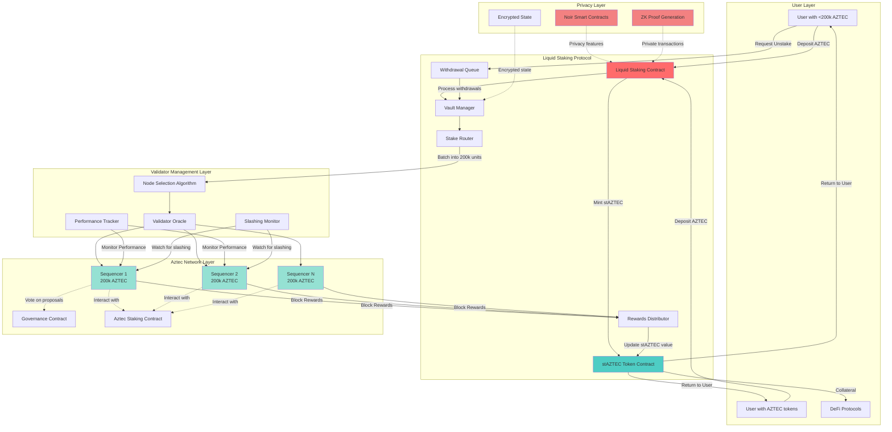

# Aztec Liquid Staking Protocol - Technical Analysis & Architecture

**Date:** December 22, 2025
**Status:** Pre-implementation Analysis
**Priority:** 🔥 URGENT - Tier 1 Opportunity

---

## Executive Summary

Aztec Network presents a **first-mover opportunity** for liquid staking on a privacy-focused Ethereum L2. With native staking live since November 2025, a 200,000 AZTEC minimum stake requirement, and only two unidentified teams currently building fractional staking solutions, there is a narrow window to capture significant market share.

**Key Facts:**
- **Launch:** November 2025 (Mainnet live)
- **Validators:** 500+ sequencers at launch, now ~1,000 in validator set
- **Minimum Stake:** 200,000 AZTEC (~$6,000 at token sale prices)
- **Token Sale:** Dec 2-6, 2025 - 19,476 ETH raised, 16,700 participants
- **Liquid Staking Status:** ❌ NOT AVAILABLE (two teams building)
- **Network Type:** Privacy-first ZK-Rollup L2 on Ethereum
- **Backing:** Vitalik-supported project

---

## Architecture Diagram



---

## Technical Requirements Analysis

### 1. Core Smart Contract Architecture

#### 1.1 Liquid Staking Contract (LSC)
**Purpose:** Main entry point for users to deposit and withdraw AZTEC tokens

**Key Functions:**
```typescript
// Deposit AZTEC and receive stAZTEC
function deposit(uint256 amount) returns (uint256 stAztecAmount)

// Request withdrawal (enters queue)
function requestWithdrawal(uint256 stAztecAmount) returns (uint256 requestId)

// Claim withdrawn AZTEC after unbonding period
function claimWithdrawal(uint256 requestId) returns (uint256 aztecAmount)

// Get current exchange rate
function getExchangeRate() returns (uint256 rate)
```

**Critical Features:**
- Accept deposits of any size (no 200k minimum for users)
- Pool deposits to create 200k AZTEC validator units
- Handle fractional ownership via stAZTEC tokens
- Manage withdrawal queue during unbonding periods
- Emergency pause mechanism

#### 1.2 stAZTEC Token Contract
**Token Model Options:**

**Option A: Rebasing Token (like Lido's stETH)**
- Balance increases automatically as rewards accrue
- Pros: Intuitive for users (1 AZTEC → 1 stAZTEC at start)
- Cons: Complex DeFi integration, tax implications

**Option B: Reward-Bearing Token (like Rocket Pool's rETH)**
- Fixed supply, value appreciates vs AZTEC
- Pros: Simpler DeFi integration, cleaner tax treatment
- Cons: Exchange rate calculation needed

**Recommendation:** **Option B (Reward-Bearing)** for better DeFi composability

**Token Features:**
- ERC-20 compatible
- Transfer restrictions during unstaking period
- Oracle for exchange rate
- Permit (EIP-2612) for gasless approvals

#### 1.3 Vault Manager
**Purpose:** Pool management and validator coordination

**Responsibilities:**
- Aggregate user deposits into 200k AZTEC batches
- Distribute batches across validators
- Track which validators hold protocol stake
- Rebalance stake across validator set
- Handle validator exits and migrations

**Key Data Structures:**
```typescript
struct ValidatorBatch {
    address validatorAddress;
    uint256 stakedAmount; // Always 200k or 0
    uint256 activatedTimestamp;
    uint256 accumulatedRewards;
    bool isActive;
}

struct UserPosition {
    uint256 stAztecBalance;
    uint256[] withdrawalRequests;
    uint256 depositedAztec;
    uint256 claimedRewards;
}
```

#### 1.4 Stake Router
**Purpose:** Intelligent validator selection and distribution

**Selection Criteria:**
- Performance metrics (block proposal success rate)
- Geographic distribution
- Slashing history
- Commission rates (if validators offer different rates)
- Uptime statistics

**Algorithm:**
```typescript
function selectValidator() returns (address) {
    // 1. Filter out slashed validators
    // 2. Weight by performance score
    // 3. Apply geographic diversity bonus
    // 4. Random selection from top performers
    // 5. Return validator address
}
```

#### 1.5 Rewards Distributor
**Purpose:** Collect and distribute staking rewards

**Mechanism:**
- Monitor block rewards from each validator
- Calculate protocol fee (5-10% suggested)
- Update stAZTEC exchange rate
- Compound rewards automatically
- Handle edge cases (slashing, validator downtime)

**Fee Structure:**
```
Total Rewards: 100%
├─ Protocol Fee: 10% (5% operations, 5% insurance fund)
└─ Stakers: 90% (distributed via stAZTEC appreciation)
```

#### 1.6 Withdrawal Queue
**Purpose:** Manage unbonding period and withdrawals

**Process:**
1. User requests withdrawal by burning stAZTEC
2. Request enters queue with timestamp
3. Protocol unstakes from validators (respecting unbonding period)
4. User claims AZTEC after unbonding complete

**Queue Management:**
- FIFO (First In, First Out) processing
- Batch processing for gas efficiency
- Maintain liquidity buffer (5-10% of TVL unstaked)
- Express withdrawal option (premium fee, instant liquidity from buffer)

---

### 2. Aztec-Specific Technical Considerations

#### 2.1 Privacy Integration
**Challenge:** Aztec is privacy-focused, but liquid staking requires public state

**Solution Architecture:**
- **Public contracts** for pooling and validator management
- **Private transactions** for user deposits/withdrawals (optional)
- **Hybrid approach:** Users can choose public or private participation

**Privacy Features to Leverage:**
```noir
// Noir contract for private staking deposits
contract PrivateStaking {
    // Private state for user balances
    mapping(AztecAddress => private PrivateBalance) private_balances;

    // Public state for total staked
    public total_staked: Field;

    // Allow users to stake privately
    #[private]
    fn deposit_private(amount: Field) -> Field {
        // Generate ZK proof of deposit
        // Update private balance
        // Increment public total
    }
}
```

#### 2.2 Sequencer Architecture Integration
**Aztec's Unique Model:**
- Sequencers are randomly selected from validator set
- Block proposers receive rewards
- Provers share in rewards (14-level proof tree)
- Governance participation tied to staking

**Liquid Staking Implications:**
- Protocol must run sequencers OR delegate to existing operators
- Need to capture both proposer and prover rewards
- Governance voting rights: delegate to users or protocol-managed?

**Governance Strategy:**
```
Option 1: Snapshot-style delegation
- stAZTEC holders vote on how protocol votes
- Maintains decentralization

Option 2: Protocol governance committee
- Elected committee manages protocol's voting power
- More efficient but more centralized

Recommendation: Option 1 (Snapshot delegation)
```

#### 2.3 Slashing and Risk Management
**Aztec Slashing Redesign (2025):**
- Penalties for longer outages (>20 minutes)
- Better consensus guarantees
- Less punitive for home stakers

**Protocol Risk Mitigation:**
1. **Diversification:** Stake across 50+ validators minimum
2. **Insurance Fund:** 5% of fees go to slashing insurance
3. **Performance Monitoring:** Remove underperforming validators
4. **Slashing Coverage:** Protocol absorbs first X% of slashing losses

**Insurance Fund Math:**
```
Target Insurance: 5% of TVL
At 1M AZTEC TVL: 50k AZTEC insurance fund
Expected slashing rate: <0.1% annually
Coverage ratio: 50x expected losses
```

---

### 3. Oracle and Off-Chain Infrastructure

#### 3.1 Validator Oracle
**Purpose:** Track validator performance and status

**Data Collection:**
- Block proposal success rate
- Attestation performance
- Uptime metrics
- Slashing events
- Rewards earned
- Geographic location
- Node software version

**Implementation:**
```typescript
interface ValidatorMetrics {
    address: string;
    blocksProposed: number;
    blocksSuccessful: number;
    attestations: number;
    uptime: number; // percentage
    slashingEvents: SlashingEvent[];
    totalRewards: bigint;
    lastUpdated: timestamp;
}
```

**Oracle Update Frequency:**
- Critical metrics (slashing): Real-time
- Performance metrics: Every epoch (~6.4 minutes on Ethereum, TBD for Aztec)
- Rewards: Every block or epoch

#### 3.2 Exchange Rate Oracle
**Purpose:** Calculate stAZTEC:AZTEC exchange rate

**Formula:**
```
exchange_rate = (total_aztec_controlled) / (total_stAztec_supply)

Where:
total_aztec_controlled = staked_aztec + pending_rewards + liquidity_buffer - slashing_losses
```

**Update Triggers:**
- New rewards received
- Deposits/withdrawals processed
- Slashing event
- Minimum: Once per epoch

#### 3.3 Keeper Bots
**Required Automation:**

1. **Staking Bot**
   - Monitors deposit pool
   - Triggers batch staking when 200k AZTEC accumulated
   - Selects validators via Stake Router

2. **Rewards Bot**
   - Claims rewards from validators
   - Triggers exchange rate update
   - Compounds rewards

3. **Withdrawal Bot**
   - Processes withdrawal queue
   - Unstakes from validators as needed
   - Fulfills withdrawal requests

4. **Rebalancing Bot**
   - Monitors validator performance
   - Migrates stake from poor performers
   - Maintains target distribution

**Incentive Structure:**
- Keeper reward: 0.1% of transaction value
- Gas costs reimbursed from protocol fees

---

### 4. Security Considerations

#### 4.1 Smart Contract Security

**Critical Vulnerabilities to Address:**

1. **Reentrancy Attacks**
   - Use OpenZeppelin's ReentrancyGuard
   - Checks-Effects-Interactions pattern
   - Pull over push for withdrawals

2. **Oracle Manipulation**
   - Multi-source oracle data
   - Median calculation vs single source
   - Staleness checks (reject data >1 epoch old)

3. **Validator Cartel Risk**
   - Maximum stake per validator (e.g., 5% of TVL)
   - Geographic diversity requirements
   - Forced rotation mechanism

4. **Upgrade Risk**
   - Timelock on upgrades (48-72 hours)
   - Multi-sig governance (5-of-9 or similar)
   - Emergency pause function (separate from upgrades)

**Audit Requirements:**
- Minimum 2 independent audits (Trail of Bits, OpenZeppelin, ConsenSys Diligence, etc.)
- Formal verification of critical functions
- Bug bounty program ($1M+ pool)
- Gradual TVL ramp (cap at $10M for first month)

#### 4.2 Economic Security

**Attack Vectors:**

1. **Liquidity Squeeze**
   - Risk: All users withdraw simultaneously
   - Mitigation: Withdrawal queue + liquidity buffer + gradual unstaking

2. **Oracle Manipulation**
   - Risk: Fake validator performance data to steal rewards
   - Mitigation: Multiple oracle sources, slashing for false reporting

3. **Validator Collusion**
   - Risk: Protocol-controlled validators collude to extract value
   - Mitigation: Stake across diverse, independent operators

**Economic Parameters:**
```
Liquidity Buffer: 10% of TVL (maintained unstaked)
Max Withdrawal Per Epoch: 5% of TVL
Unbonding Period: Match Aztec's native unbonding (likely ~7 days)
Protocol Fee: 10% of rewards
Insurance Fund: 5% of TVL target
```

---

## Development Roadmap

### Phase 1: Research & Design (Weeks 1-2)
- [ ] Deep dive on Aztec staking contract internals
- [ ] Identify the two teams building fractional staking
- [ ] Assess partnership vs. competition strategy
- [ ] Finalize smart contract architecture
- [ ] Design tokenomics and fee structure
- [ ] Create formal specification document

### Phase 2: MVP Development (Weeks 3-6)
- [ ] Develop core smart contracts (Solidity/Noir)
- [ ] Implement stAZTEC token contract
- [ ] Build Vault Manager and Stake Router
- [ ] Create basic frontend (deposit/withdraw UI)
- [ ] Develop keeper bot infrastructure
- [ ] Internal security review

### Phase 3: Testnet Deployment (Weeks 7-8)
- [ ] Deploy to Aztec testnet
- [ ] Internal testing with team funds
- [ ] Bug bounty (private, $50k pool)
- [ ] Performance optimization
- [ ] Documentation and developer guides

### Phase 4: Security & Audit (Weeks 9-12)
- [ ] Engage 2+ audit firms
- [ ] Address audit findings
- [ ] Formal verification of critical paths
- [ ] Public bug bounty ($500k-$1M pool)
- [ ] Mainnet deployment preparation

### Phase 5: Mainnet Launch (Week 13+)
- [ ] Deploy to Aztec mainnet
- [ ] TVL cap: $1M (Week 1)
- [ ] TVL cap: $10M (Month 1)
- [ ] TVL cap: $50M (Month 2)
- [ ] Remove cap after 3 months of operation
- [ ] DeFi integrations (Uniswap, lending protocols)

### Phase 6: Expansion (Month 4+)
- [ ] Governance token launch (if applicable)
- [ ] Advanced features (flash withdrawals, strategies)
- [ ] Multi-sig to DAO transition
- [ ] Cross-chain bridges for stAZTEC
- [ ] Institutional product tier

**Total Time to Market: 3-4 months**

---

## Competitive Landscape: The Two Teams

### What We Know

From Aztec's official communications and web research:
- **Two teams** are confirmed to be building fractional staking solutions
- Target launch: **Token transferability date** (TBD, post-TGE)
- **No public disclosure** of team names or project details
- Focus: Enable staking for holders with <200,000 AZTEC

### Intelligence Gathering Strategy

**Immediate Actions:**
1. **Aztec Foundation Outreach**
   - Contact Aztec Labs/Foundation
   - Request information on ecosystem projects
   - Inquire about partnership opportunities

2. **Community Research**
   - Monitor Aztec Discord/Telegram
   - Track GitHub activity (Aztec ecosystem repos)
   - Follow Aztec team members on Twitter/X
   - Attend Aztec community calls

3. **Competitive Analysis Framework**
   ```
   For each identified team, research:
   ├─ Team background (prior projects, experience)
   ├─ Funding status (bootstrapped vs. VC-backed)
   ├─ Technical approach (architecture, privacy features)
   ├─ Timeline to market (launch date estimates)
   ├─ Market positioning (institutional vs. retail)
   └─ Partnership strategy (independent vs. Aztec-supported)
   ```

### Likely Team Profiles

**Team Type 1: Existing LST Protocol**
- **Example Candidates:** Lido, Rocket Pool, Ankr (multi-chain expansion)
- **Advantages:** Brand recognition, existing user base, proven tech
- **Disadvantages:** Slower to market, less Aztec-specific optimization
- **Likelihood:** Medium (requires Aztec-specific development)

**Team Type 2: Aztec Native Project**
- **Example Candidates:** Projects building on Aztec from early days
- **Advantages:** Deep Aztec knowledge, privacy-first design, community support
- **Disadvantages:** Less liquid staking experience, smaller team
- **Likelihood:** High (aligns with "two teams building" narrative)

**Team Type 3: New Startup**
- **Example Candidates:** Stealth teams from Ethereum staking space
- **Advantages:** Focused entirely on Aztec opportunity, fast-moving
- **Disadvantages:** No track record, limited resources
- **Likelihood:** High (startup velocity needed for this opportunity)

### Competitive Strategy Options

**Option A: Partner with One Team**
- Combine resources to build superior product
- Share market rather than fragment
- Faster time to market via collaboration
- Risk: Partner may defect or underperform

**Option B: Compete Directly**
- Build independently, aim to be first/best
- Capture 100% of market vs. sharing
- Differentiate via features (privacy, UX, DeFi integrations)
- Risk: Winner-takes-most market dynamics

**Option C: Build Different Product Tier**
- Team 1 targets retail, Team 2 targets institutional
- Avoid direct competition via segmentation
- Potential collaboration on infrastructure
- Risk: Market may prefer one-stop-shop solution

**Recommendation:** **Option B (Compete)** with **Option C (Differentiation) fallback**
- Attempt to be first to market with retail product
- If outpaced, pivot to institutional tier with DVT integration
- Monitor both competitors closely and adapt strategy

---

## Market Sizing & Business Model

### Total Addressable Market (TAM)

**Aztec Token Sale Metrics:**
- ETH Raised: 19,476 ETH (~$73M at $3,750/ETH)
- Participants: 16,700 individuals
- Average Investment: ~$4,370 per participant

**Staking Assumptions:**
```
Scenario A (Conservative):
├─ Participants with <200k AZTEC: 90% (15,030 people)
├─ Average holdings: $4,000 per person
├─ Staking rate: 30% (similar to early Ethereum)
└─ TAM: $18M TVL

Scenario B (Moderate):
├─ Total AZTEC market cap: $500M (year 1 estimate)
├─ Staking rate: 50% (mature market)
├─ Liquid staking capture: 40% (vs. native staking)
└─ TAM: $100M TVL

Scenario C (Optimistic):
├─ Total AZTEC market cap: $2B (if privacy narrative takes off)
├─ Staking rate: 70% (Ethereum-like participation)
├─ Liquid staking capture: 60% (dominant solution)
└─ TAM: $840M TVL
```

**Target Market Share:**
- Year 1: 40-60% of liquid staking market
- Year 2: Maintain 30-50% (as competitors enter)

**Revenue Projections:**
```
Year 1 (Conservative):
├─ TVL: $20M average
├─ Staking APR: 8% (estimated Aztec rewards)
├─ Protocol Fee: 10% of rewards
├─ Annual Revenue: $160k
└─ Monthly Revenue: $13k

Year 1 (Moderate):
├─ TVL: $50M average
├─ Staking APR: 8%
├─ Protocol Fee: 10%
├─ Annual Revenue: $400k
└─ Monthly Revenue: $33k

Year 2 (Optimistic):
├─ TVL: $200M average
├─ Staking APR: 6% (lower as network matures)
├─ Protocol Fee: 10%
├─ Annual Revenue: $1.2M
└─ Monthly Revenue: $100k
```

### Business Model

**Revenue Streams:**
1. **Staking Fees:** 10% of all staking rewards (primary)
2. **Express Withdrawal Fee:** 0.5% for instant withdrawals (secondary)
3. **Performance Fees:** 20% of excess returns vs. baseline (optional)

**Cost Structure:**
```
Fixed Costs:
├─ Smart contract audits: $200k (one-time)
├─ Infrastructure (servers, oracles): $5k/month
├─ Team salaries (3-5 people): $50k/month
└─ Legal/compliance: $10k/month

Variable Costs:
├─ Gas fees (keeper bots): ~0.5% of fees
├─ Insurance fund: 5% of fees
└─ Bug bounty payouts: Capped at $1M
```

**Break-Even Analysis:**
```
Monthly costs: ~$65k
Required monthly revenue: $65k
Required TVL at 10% fee, 8% APR: $97.5M

Realistic break-even: 6-12 months post-launch
```

---

## Risk Analysis

### Technical Risks

| Risk | Likelihood | Impact | Mitigation |
|------|------------|--------|------------|
| Smart contract exploit | Medium | Critical | Multiple audits, gradual TVL ramp, insurance fund |
| Aztec protocol bug | Low | High | Diversification, insurance, close monitoring |
| Oracle failure | Medium | High | Multi-source oracles, fallback mechanisms |
| Slashing event | Medium | Medium | Validator diversification, insurance fund |
| Noir compatibility issues | Medium | Medium | Hybrid public/private approach, extensive testing |

### Market Risks

| Risk | Likelihood | Impact | Mitigation |
|------|------------|--------|------------|
| Competitors launch first | High | High | Sprint to market, differentiate via features |
| Low AZTEC staking demand | Medium | Critical | Market research, user interviews, marketing |
| AZTEC price collapse | Medium | Medium | Revenue in AZTEC + ETH hedge, sustainable costs |
| Regulatory crackdown | Low | High | Legal review, decentralization, geographic diversity |
| Lido/major player enters | Low | High | First-mover advantage, Aztec-specific optimization |

### Operational Risks

| Risk | Likelihood | Impact | Mitigation |
|------|------------|--------|------------|
| Team capacity constraints | Medium | Medium | Hire experienced Solidity/Noir devs, outsource non-core |
| Aztec ecosystem too small | Medium | High | Multi-chain expansion plan (backup options) |
| Governance attacks | Low | Medium | Multi-sig, timelocks, community involvement |
| Key person dependency | Medium | Medium | Documentation, knowledge sharing, redundancy |

---

## Next Steps (Immediate Actions)

### Week 1: Intelligence & Strategy
- [ ] **Day 1-2:** Contact Aztec Foundation (partnerships team)
- [ ] **Day 2-3:** Deep dive Aztec staking contract (on-chain + docs)
- [ ] **Day 3-4:** Identify competitor teams (Discord, GitHub, Twitter)
- [ ] **Day 4-5:** User interviews (token sale participants)
- [ ] **Day 5-7:** Finalize architecture and strategy doc

### Week 2: Team & Resources
- [ ] Assemble core team (2-3 developers, 1 designer, 1 product)
- [ ] Engage audit firms (get on their calendar ASAP)
- [ ] Set up development infrastructure (testnet nodes, etc.)
- [ ] Create project roadmap and Gantt chart
- [ ] Secure initial funding ($200k-$500k for 6 months runway)

### Week 3-4: Kick-off Development
- [ ] Smart contract development sprint 1
- [ ] Frontend mockups and designs
- [ ] Technical specification document (detailed)
- [ ] Risk assessment and security review (internal)
- [ ] Community engagement (Twitter, Discord presence)

---

## Conclusion

Aztec liquid staking represents a **rare first-mover opportunity** in a nascent but promising ecosystem. The combination of:

1. ✅ **High barrier to entry** (200k AZTEC minimum)
2. ✅ **Strong backing** (Vitalik, successful token sale)
3. ✅ **Privacy narrative** (unique positioning)
4. ✅ **Limited competition** (only 2 known teams)
5. ✅ **Growing ecosystem** (500+ validators, active development)

...creates an ideal environment for a well-executed liquid staking protocol to capture significant value.

**Key Success Factors:**
- **Speed:** Launch before or shortly after competitors
- **Security:** Bulletproof smart contracts (this is non-negotiable)
- **UX:** Simple, intuitive interface (lower barrier than competition)
- **Privacy:** Leverage Aztec's unique privacy features
- **Community:** Build trust with Aztec community early

**Estimated Timeline:** 3-4 months to mainnet launch
**Estimated Investment:** $200k-$500k (development + audits)
**Target Year 1 TVL:** $50M-$100M
**Target Year 1 Revenue:** $400k-$800k

**Recommendation:** **PROCEED** with full development and launch ASAP.

---

## Sources & References

- [Aztec Network](https://aztec.network/)
- [Aztec Staking Dashboard](https://stake.aztec.network/)
- [$AZTEC TGE: Next Steps For Holders](https://aztec.network/blog/aztec-tge-next-steps)
- [What Is Aztec Network (AZTEC)? A Vitalik-backed Privacy ETH L2 | CoinGecko](https://www.coingecko.com/learn/what-is-aztec-network-ethereum-privacy-layer-2)
- [Analyzing Aztec's Decentralized Sequencer Solution | Gate.com](https://www.gate.com/learn/articles/analyzing-aztecs-decentralized-sequencer-solution/1918)
- [Aztec Documentation | Privacy-first zkRollup](https://docs.aztec.network/)
- [Running a Sequencer | Aztec Documentation](https://docs.aztec.network/the_aztec_network/setup/sequencer_management)
- [Aztec Network Token Sale Explained](https://laikalabs.ai/en/blogs/aztec-network-token-sale-overview)
- Internal research: `liquid-staking-landscape-2025.md`
- Internal research: `OPPORTUNITIES.md`

---

**Document Version:** 1.0
**Last Updated:** December 22, 2025
**Next Review:** January 2026 (or upon competitor identification)
