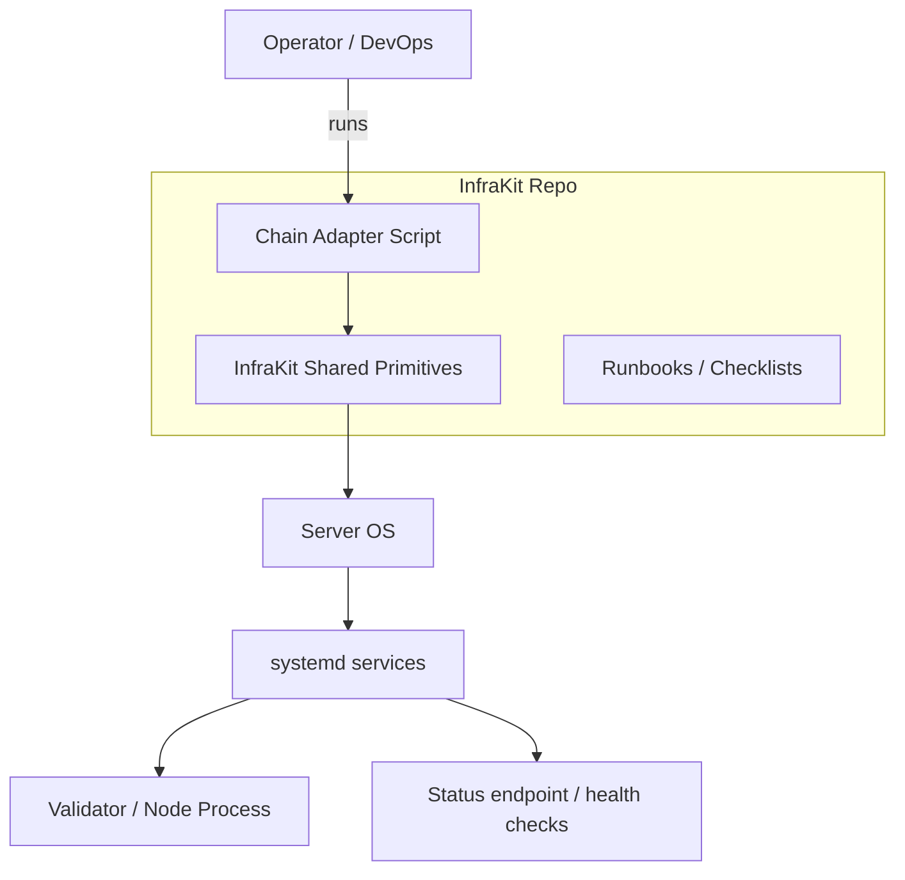

# InfraKit Design (Concise)

## One‑Sentence Summary
InfraKit is a shell‑first, shared infra kit that standardizes validator server setup (provisioning, hardening, services, monitoring) across chains, with thin chain‑specific adapters.

## What It Is (MVP)
- A **repo of scripts + runbooks** (not a hosted control plane).
- **Shared primitives** for common ops tasks.
- **Adapters** that stitch primitives into chain‑specific flows.

## What It Is Not (Yet)
- No central UI/control plane service.
- No Kubernetes orchestration (future optional phase).
- No single “one‑size‑fits‑all” validator client install logic.

## Top‑Level Architecture (Human Review)



## Component Layers

```mermaid
flowchart TB
  A[Adapters
(chain-specific)] --> B[Shared Primitives
(provision/hardening/services/monitoring)]
  B --> C[OS & systemd]
  C --> D[Chain Binaries & Config]
```

## Reuse Strategy (80/20)
- **Shared 80%:** OS updates, SSH hardening, firewall, fail2ban, sysctl, systemd install helpers, status/health endpoints.
- **Adapter 20%:** chain binaries, configs, ports, RPC/metrics checks, role-specific steps.

## Minimal Extensible Product (MEP)
1) Shared primitives (shell + small Python helpers).
2) One adapter per chain/role (Monad validator, Ethereum L1 validator, Aztec roles when finalized).
3) A runbook + smoke test per adapter.

## Evolution Path
- **Phase 1:** Shell/systemd (current target).
- **Phase 2:** Container‑friendly wrappers (same primitives).
- **Phase 3:** Optional orchestration (Kubernetes or control plane).
