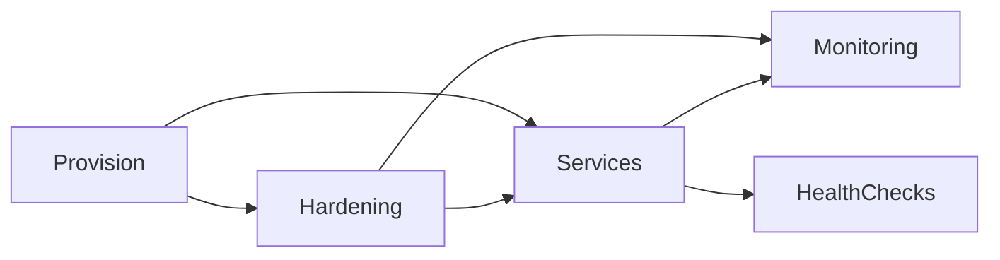

# InfraKit Design (Concise)

## One‑Sentence Summary
InfraKit is a **shared staking infra layer** that standardizes server setup and operations across chains using shared shell primitives plus thin chain adapters.

## What It Is (MVP)
- A **repository‑based control plane** (scripts + runbooks).
- **Shared primitives** for provisioning, hardening, services, monitoring.
- **Adapters** for chain‑specific installs/configs.

## What It Is Not (Yet)
- No hosted central UI/API control plane (optional future phase).
- No Kubernetes orchestration (optional future phase).

## Top‑Level Architecture (Human Review)

```mermaid
flowchart TB
  Operator[Operator / DevOps] --> Adapter[Chain Adapter Script]

  Adapter --> Shared[InfraKit Shared Primitives]
  Shared --> Host[Server OS]

  Host --> EthStack[ETH L1 Stack\nExecution + Consensus + MEV]
  Host --> MonadStack[Monad Stack\nmonad-bft + configs]
  Host --> AztecStack[Aztec Stack\n(dev/test now; prod roles TBD)]

  EthStack --> EthServices[systemd units + env]
  MonadStack --> MonadServices[systemd units + env]
  AztecStack --> AztecServices[toolchain/tests now]

  subgraph InfraKit Repo (MVP control plane)
    Adapter
    Shared
    Runbook[Runbooks / Checklists]
  end
```

## Control Plane Evolution (Repo → Hosted)

```mermaid
flowchart LR
  Repo[Repo-based control plane\n(scripts + runbooks)] --> Hosted[Hosted control plane\n(API/UI + orchestration)]
  Hosted --> Orchestrators[Kubernetes / fleet orchestration]
```

## Component Layers

```mermaid
flowchart TB
  A[Adapters\n(chain-specific)] --> B[Shared Primitives\n(provision/hardening/services/monitoring)]
  B --> C[OS & systemd]
  C --> D[Chain Binaries & Config]
```

## Dependency Graph (Conceptual)



## Proposed File Tree (Future `staking/infra-kit/`)

```text
staking/infra-kit/
  shared/
    provision/
      base_packages.sh
      create_user.sh
    hardening/
      harden_ssh.sh
      firewall_ufw.sh
      fail2ban.sh
      sysctl.sh
    services/
      install_systemd.sh
      install_env.sh
    monitoring/
      status_server.py
      check_rpc.sh
      uptime_probe.sh
    web/
      install_nginx.sh
      install_caddy.sh
      install_ssl_certbot.sh
      install_acme_ssl.sh
  adapters/
    ethereum/
      run_1_adapter.sh
      run_2_adapter.sh
    monad/
      setup_server_adapter.sh
    aztec/
      dev_tooling_adapter.sh
  runbooks/
    ethereum.md
    monad.md
    aztec-dev.md
```

## Reuse Strategy (80/20)
- **Shared 80%:** OS updates, SSH hardening, firewall, fail2ban, sysctl, systemd install helpers, status/health endpoints.
- **Adapter 20%:** chain binaries, configs, ports, RPC/metrics checks, role‑specific steps.

## Minimal Extensible Product (MEP)
1) Shared primitives (shell + small Python helpers).
2) One adapter per chain/role (Ethereum L1, Monad validator; Aztec dev tooling).
3) A runbook + smoke test per adapter.

## Evolution Path
- **Phase 1:** Shell/systemd (current target).
- **Phase 2:** Container‑friendly wrappers (same primitives).
- **Phase 3:** Optional orchestration (Kubernetes or hosted control plane).
