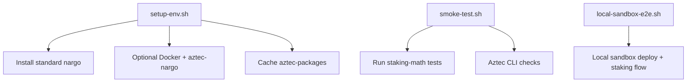

# InfraKit Spec (Verified Script‑Based)

This spec is grounded in **scripts that currently exist** (eth2‑quickstart, Monad infra, Aztec dev tooling). It avoids unverified claims and notes unknowns explicitly.

## 1) Verified Script Inventory

### eth2‑quickstart (Ethereum L1 bootstrap)
Key entrypoints (observed in repo):
- `run_1.sh` (root): OS updates, SSH hardening, user creation, consolidated security setup.
- `run_2.sh` (non‑root): dependency install, MEV selection, client selection + install.
- `exports.sh`: shared config (user, ports, MEV relays, client settings).
- `lib/common_functions.sh`: helper functions (systemd creation, firewall helpers, downloads).

**Systemd creation (verified):**
- `create_systemd_service()` writes `/etc/systemd/system/<name>.service` and enables/starts via `systemctl`.

**Client install scripts (verified examples):**
- `install/execution/geth.sh` creates systemd `eth1` service.
- `install/consensus/prysm.sh` creates systemd `cl` (beacon) and `validator` services.
- `install/mev/install_mev_boost.sh` creates systemd `mev` service.

**Flow (verified by script content):**
- Phase 1 (root): OS update → SSH hardening → user creation → consolidated security.
- Phase 2 (non‑root): dependencies → MEV choice → client choice → install scripts → systemd services.

### Monad infra (production scripts in this repo)
Entry points and critical steps (verified):
- `setup_server.sh`: create user → install monad‑bft binary (if provided) → sysctl tuning → install systemd units → optional Caddy/UFW → preflight + e2e smoke tests.
- `bootstrap_all.sh`: wraps `setup_server.sh` + optional monitoring (docker compose) + optional hardening (SSH, fail2ban, unattended upgrades).
- `install_validator_binary.sh`: fetch binary/config from local path or URL.
- `install_validator_service.sh`: installs systemd unit + env file.
- `install_status_service.sh`: installs a Python status server + unit + env file.
- Hardening utilities: `harden_ssh.sh`, `install_firewall_ufw.sh`, `install_fail2ban.sh`, `enable_unattended_upgrades.sh`.

### Aztec scripts (dev + testing toolchain)
These scripts are **developer toolchain and testing**, not validator ops:
- `scripts/setup-env.sh`: installs standard `nargo`, optional `aztec-nargo` via Docker, caches aztec‑packages deps, optional compile.
- `scripts/smoke-test.sh`: validates nargo + Aztec CLI + unit tests + optional sandbox E2E.
- `scripts/integration-test.sh`: compile contracts + run tests against Aztec devnet container (TXE).
- `scripts/local-sandbox-e2e.sh`: local sandbox deploy + end‑to‑end staking flow.

## 2) InfraKit Shared Primitives (Derived from Scripts)

These are the **common operations** we can safely reuse across chains:
- OS update + base packages
- SSH hardening
- User creation + sudo setup
- Firewall setup (UFW)
- Fail2ban + unattended upgrades
- Sysctl tuning
- Systemd unit install + env file management
- Status endpoint/health checks
- Preflight + smoke tests

## 3) Chain‑Specific Adapters (Thin by Design)

### Ethereum (eth2‑quickstart)
Adapter responsibilities based on existing scripts:
- Wire `run_1.sh` (security baseline) and `run_2.sh` (client/MEV install) into shared primitives.
- Keep client selection + install scripts under Ethereum adapter because they are chain‑specific.
- Keep MEV configuration and relay lists in Ethereum adapter (chain‑specific economics).

### Monad
Adapter responsibilities based on existing scripts:
- Use shared primitives for user, sysctl, firewall, SSH hardening, systemd.
- Keep `monad-bft` binary/config install and validator service as Monad‑specific.
- Keep status endpoint as the default shared pattern (can be reused as a shared primitive).

### Aztec
Current scripts are dev/test tooling, not validator‑role operations.
- InfraKit can reuse **testing scaffolding** patterns (env setup, smoke tests).
- **Validator/sequencer/prover ops** are TBD until production role scripts exist.

## 4) Proposed Layout (Target, Not Yet Implemented)

```text
staking/
  infra-kit/                 # future shared library (code)
    shared/
      provision/
      hardening/
      services/
      monitoring/
    adapters/
      ethereum/
      monad/
      aztec/
    runbooks/
  research/
    infra-kit/               # current research/design docs (this folder)
```

## 5) Adapter Flows (Verified)

### Monad adapter flow (current behavior)
```mermaid
flowchart TD
  A[setup_server.sh] --> B[create_monad_user.sh]
  A --> C[install_validator_binary.sh (optional)]
  A --> D[install_sysctl.sh]
  A --> E[install_validator_service.sh]
  A --> F[install_status_service.sh]
  A --> G{with-caddy?}
  A --> H{with-firewall?}
  A --> I[preflight_check.sh]
  A --> J[e2e_smoke_test.sh]
```

### Ethereum quickstart flow (current behavior)
```mermaid
flowchart TD
  R1[run_1.sh (root)] --> OS[OS update + SSH hardening]
  R1 --> User[Create user + sudo]
  R1 --> Sec[Consolidated security]
  R2[run_2.sh (non-root)] --> Deps[install_dependencies.sh]
  R2 --> MEV[MEV selection + install]
  R2 --> Clients[Execution + consensus install]
  Clients --> Services[systemd services: eth1 / cl / validator]
  MEV --> MevSvc[systemd service: mev]
```

### Aztec dev toolchain flow (current behavior)


## 6) Reuse & Boundaries

- **Reusable:** system hardening, systemd utilities, status endpoints, smoke tests.
- **Chain‑specific:** client binaries/configs, MEV logic, role semantics (sequencer/prover/validator).
- **Aztec validator roles:** not codified in current scripts; avoid assumptions until role scripts exist.

## 7) Open Items (No Hallucinations)

- Inspect eth2‑quickstart security scripts for additional reusable primitives.
- Decide whether the shared status server should be standard (Monad version is a candidate).
- Define Aztec production role scripts once available.
