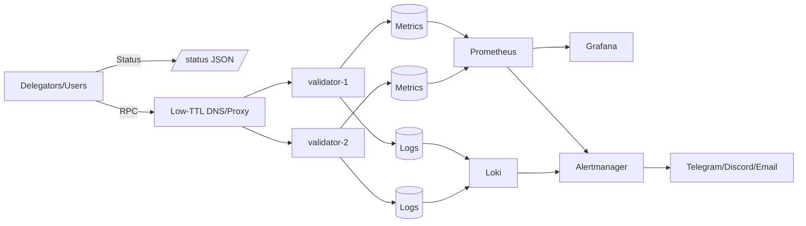
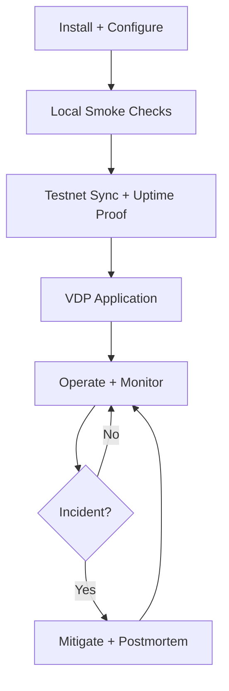

# Monad Validator Architecture & Work Plan

Brutal truth: this is doable in ~2–3.5 months at 15–25 hrs/week, but uptime discipline and fast incident response are non‑negotiable.

## 1. Architecture (MVP -> VDP -> Small Cluster)

### 1.0 Diagrams





### 1.1 MVP (Single Validator)

1) **Host roles**
   - `validator-1`: validator + local RPC + logs.
2) **Core services**
   - Validator daemon (systemd managed) from [monad](https://github.com/category-labs/monad) + [monad-bft](https://github.com/category-labs/monad-bft).
   - Basic health checks (local + external).
3) **Minimal paths**
   - Config: `~/.monad/` or `/etc/monad/` (choose one, stay consistent).
   - Logs: `/var/log/monad/`.

### 1.1.2 Canonical Paths

- Infra assets live under `staking/monad/infra/` (single source of truth).

### 1.1.1 Quickstart (Runnable MVP)

1) **Install deps**
   - Foundry: `foundryup` (for `forge`, `cast`, `anvil`).
   - Docker + compose (for monad-bft local devnet).
2) **Run local devnet**
   - `monad-bft/docker/single-node/nets/run.sh --use-prebuilt`
3) **Wire status**
   - `RPC_URL=http://localhost:8080 staking/monad/infra/scripts/status_server.py`
4) **Verify**
   - `staking/monad/infra/scripts/e2e_smoke_test.sh`

### 1.2 Add a Second Node (Geo Diversity)

1) **When**
   - After 2–4 weeks of stable single‑node uptime.
2) **Where**
   - Different provider + region (e.g., us‑east + eu‑west).
3) **How**
   - Add `validator-2` in a new region.
   - Keep a single public endpoint with low‑TTL DNS (60–120s) or a small proxy.
   - Never copy validator keys between hosts.
   - Keep keys on local disk with strict file permissions.

### 1.3 Monitoring Stack (Later)

1) **Current**
   - systemd + journalctl + external uptime monitor.
2) **Later plug‑in points**
   - Prometheus scrape targets on each validator.
   - Grafana dashboards under `~/infra/monitoring/`.
   - Loki + Promtail on each host.
3) **Where to wire**
   - Systemd overrides: `/etc/systemd/system/monad-validator.service.d/override.conf`.
   - Monitoring configs: `~/infra/monitoring/`.

### 1.4 Notification Channels (Later)

1) **Channels**
   - Telegram bot, Discord webhook, email.
2) **Where to wire**
   - Alertmanager routes in `~/infra/alerting/`.
   - Optional lightweight relay service if needed.

### 1.5 Public Stats Endpoint (Later)

1) **Goal**
   - Provide uptime + sync status to delegators.
2) **Minimal endpoint**
   - `/status` -> `{"uptime":"99.9","block_height":123456,"last_seen":"..."}`
3) **Where to host**
   - Small read‑only service in `~/infra/status-api/`.

### 1.6 Key Management (No HSM)

1) **Policy**
   - Software keys only; no HSM requirement.
2) **Storage**
   - Local disk with minimal permissions; backup encrypted offline only.
3) **Rotation**
   - Document exact rotation steps in the runbook (do not improvise during incidents).

### 1.7 Evolve to Small Cluster (No Rework)

1) **Phase 1**
   - Single validator + health checks.
2) **Phase 2**
   - Second validator + geo diversity + failover runbook.
3) **Phase 3**
   - 3–4 nodes (validator, RPC, monitoring, indexer).
4) **Rule**
   - Duplicate configs and adjust; do not redesign from scratch.

---

## 2. Work Plan (Step‑by‑Step)

### 2.0 Must‑Read Research Checklist (Prioritized)

1) [Monad Docs hub](https://docs.monad.xyz/) — entry point and source of truth.
2) [Node Operations overview](https://docs.monad.xyz/node-ops/) — validator vs. full node scope.
3) [Hardware Requirements](https://docs.monad.xyz/node-ops/hardware-requirements) — baseline sizing inputs.
4) [Validator Installation](https://docs.monad.xyz/node-ops/validator-installation) — setup steps and validator‑specific deltas.
5) [Full Node Installation](https://docs.monad.xyz/node-ops/full-node-installation) — useful for RPC/infra separation later.
6) [General Operations](https://docs.monad.xyz/node-ops/general-operations) — day‑to‑day ops expectations.
7) [Node Recovery](https://docs.monad.xyz/node-ops/node-recovery/) — disaster recovery playbook.
8) [Upgrade Instructions](https://docs.monad.xyz/node-ops/upgrade-instructions/) — pin, upgrade, rollback cadence.
9) [VDP Guidelines](https://docs.monad.xyz/node-ops/validator-delegation-program/) — eligibility, uptime, commission, removals.
10) [MEV Systems Policy](https://docs.monad.xyz/node-ops/validator-delegation-program/mev) — compliance constraints.
11) [Testnets](https://docs.monad.xyz/developer-essentials/testnets) + [Network Info](https://docs.monad.xyz/developer-essentials/network-information) — chain IDs, endpoints.
12) [Testnet Faucet](https://docs.monad.xyz/developer-essentials/faucet) — funding for ops tests.
13) [Staking SDK CLI](https://github.com/monad-developers/staking-sdk-cli) — keygen/registration/delegation tooling.
14) [Execution client](https://github.com/category-labs/monad) + [Consensus/BFT](https://github.com/category-labs/monad-bft) — core client source.
15) [Monad Developers org](https://github.com/monad-developers) — utilities and examples.

### 2.1 Week 1–2: MVP Validator + Uptime Proof

1) **Install validator** (one host) via [Validator Installation](https://docs.monad.xyz/node-ops/validator-installation).
2) **Systemd unit** (skeleton only):
   - `/etc/systemd/system/monad-validator.service`.
3) **Health check**
   - `curl -s <rpc-url> | head -c 200`.
   - Optional: `curl -s <rpc-url> | jq -r .result` if JSON‑RPC.
4) **Uptime proof**
   - Create a public uptime monitor (StatusCake/UptimeRobot).
5) **Runbook v1**
   - Restart + rollback steps.
6) **Kernel tuning (from monad-bft README)**
   - Hugepages + UDP/TCP buffer tuning for consensus/RPC stability.
   - Example file: `/etc/sysctl.d/99-custom-monad.conf` from [monad-bft](https://github.com/category-labs/monad-bft):
     ```conf
     vm.nr_hugepages = 2048
     net.core.rmem_max = 62500000
     net.core.rmem_default = 62500000
     net.core.wmem_max = 62500000
     net.core.wmem_default = 62500000
     net.ipv4.tcp_rmem = 4096 62500000 62500000
     net.ipv4.tcp_wmem = 4096 62500000 62500000
     ```
7) **Memory requirement**
   - Local devnet requires enough RAM to allocate hugepages; plan for >= 8–16 GiB.

### 2.2 Week 3–6: VDP Readiness

1) **Incident response**
   - 15–30 min response SLA.
2) **Log discipline**
   - Log rotation + disk alerts.
3) **Public reliability signal**
   - Simple status page or uptime link.
4) **Documentation**
   - Weekly outage summary + fix notes.
5) **VDP paperwork**
   - Review [VDP guidelines](https://docs.monad.xyz/node-ops/validator-delegation-program/) and submit [VDP application](https://tally.so/r/81N1KO) when uptime proof is stable.

### 2.3 Pre‑Testnet Validation (Local + Dry Runs)

1) **Local smoke checks**
   - Process starts cleanly and stays up for 60+ minutes.
   - RPC responds: `curl -s <rpc-url> | head -c 200`.
   - Disk + memory headroom verified (no swap thrash).
2) **Local E2E checks**
   - Sync to a known block height.
   - Validator signs/produces expected events (per docs).
   - For local devnet smoke: monad-bft `docker/single-node` (chain ID 20143, RPC `localhost:8080`) in [monad-bft](https://github.com/category-labs/monad-bft).
   - Local docker build expectations: x86 CPU, 4+ cores, 60+ GB disk per [monad-bft](https://github.com/category-labs/monad-bft).
3) **Failure simulation**
   - Restart service twice; confirm recovery time.
   - Force log rotation; confirm no data loss.

### 2.4 Week 7–10: Geo Diversity + Monitoring Hooks

1) **Second validator**
   - Different region/provider.
2) **Failover**
   - DNS TTL or proxy with documented switch steps.
3) **Monitoring hooks**
   - Add Prometheus endpoints (no full stack yet).

### 2.5 Week 11–14: Expand Observability + Alerting

1) **Prometheus + Grafana**
   - Basic dashboard: uptime, lag, disk, memory.
2) **Loki + Promtail**
   - Central log search.
3) **Alert channels**
   - Telegram + Discord + email routing.

## 2.6 Testnet Deploy Requirements (Technical)

1) **Prereqs**
   - Stable node binary/version pinned.
   - Config baseline committed in `~/infra/config/monad/`.
   - Keys generated and stored locally.
   - Testnet funds from [Faucet](https://docs.monad.xyz/developer-essentials/faucet) for tx validation.
   - CPU ISA support at least x86-64-v3 per [monad execution README](https://github.com/category-labs/monad).
2) **Host readiness**
   - Time sync enabled (chrony/ntpd).
   - Disk alerts at 80%+.
   - Log rotation enabled.
3) **Testnet bootstrap**
   - Genesis/config pulled from official source in [Node Ops](https://docs.monad.xyz/node-ops/).
   - Network details from [Testnets](https://docs.monad.xyz/developer-essentials/testnets) and [Network Info](https://docs.monad.xyz/developer-essentials/network-information).
4) **Post‑deploy verification**
   - Node synced within expected window.
   - RPC responds consistently under light polling.
   - Uptime monitor live and reporting.

## 2.7 Validator Exit Process (Current Docs)

1) **Exit trigger**
   - Operator‑initiated exit request (no explicit “validator exit” doc found; use staking flows).
2) **Exit phases**
   - Undelegate stake → wait for withdrawal delay → withdraw (per staking behavior).
3) **Operational requirement**
   - Keep the node online until exit finalizes (avoid penalties).
4) **Action items**
   - Use undelegate/withdraw flows in [staking-sdk-cli](https://github.com/monad-developers/staking-sdk-cli) once exact validator exit docs are confirmed.
    - Current staking behavior shows `WITHDRAWAL_DELAY = 1 epoch` for withdrawals after unstake per [staking behavior](https://docs.monad.xyz/developer-essentials/staking/staking-behavior).
    - Record exact exit command + expected time window once validator‑specific exit docs are confirmed.
   - Define “safe to stop” criteria in the runbook.

## 2.8 Automation (Scripts + Watchers)

### 2.8.1 Scripts (Plan Only)

1) **Deploy helper** (no code yet)
   - Inputs: config path, keys path, chain ID (see [Staking SDK CLI](https://github.com/monad-developers/staking-sdk-cli)).
2) **Exit helper** (no code yet)
   - Inputs: validator ID, exit reason, confirmation checklist.
3) **Rule**
   - Keep scripts minimal; do not automate irreversible actions without manual confirmation.
4) **MVP helpers (in repo)**
   - `staking/monad/infra/scripts/check_rpc.sh`
   - `staking/monad/infra/scripts/uptime_probe.sh`
   - `staking/monad/infra/scripts/status_server.py`
   - `staking/monad/infra/scripts/collect_node_info.sh`
   - `staking/monad/infra/scripts/run_local_devnet.sh`
   - `staking/monad/infra/scripts/check_prereqs.sh`
   - `staking/monad/infra/scripts/install_sysctl.sh`
   - `staking/monad/infra/scripts/install_systemd_unit.sh`
   - `staking/monad/infra/scripts/install_status_service.sh`
   - `staking/monad/infra/scripts/install_validator_service.sh`
   - `staking/monad/infra/scripts/preflight_check.sh`
   - `staking/monad/infra/scripts/install_caddy.sh`
   - `staking/monad/infra/scripts/setup_server.sh`
   - `staking/monad/infra/scripts/e2e_smoke_test.sh`
   - `staking/monad/infra/RUNBOOK.md`
   - `staking/monad/infra/DEPLOY_CHECKLIST.md`
   - `staking/monad/infra/config/README.md`
   - `staking/monad/infra/watchers/README.md`

### 2.8.2 Chain State Watchers

1) **What to watch**
   - Sync lag, missed slots, validator status, slashing events (if exposed).
2) **Triggers**
   - Alert on lag > threshold or status changes (active → jailed/penalized).
3) **Where to wire**
   - Local watcher service in `~/infra/watchers/` → Alertmanager routes.

## 3. Spec Additions (Keep This Tight)

### 3.1 VDP Rules (Must Confirm)

1) **Uptime threshold**: 98% weekly minimum per [VDP guidelines](https://docs.monad.xyz/node-ops/validator-delegation-program/).
2) **Commission cap**: 10% (temporarily 20%) per [VDP guidelines](https://docs.monad.xyz/node-ops/validator-delegation-program/).
3) **MEV policy**: must comply with [MEV Systems Policy](https://docs.monad.xyz/node-ops/validator-delegation-program/mev).
4) **Eligibility**: maintain a testnet validator during VDP participation and 4+ weeks active ops for evaluation per [VDP guidelines](https://docs.monad.xyz/node-ops/validator-delegation-program/).
5) **Removal triggers**: <98% weekly uptime 3 times in 3 months, alt binary use, or peering with centralized flow routers per [VDP guidelines](https://docs.monad.xyz/node-ops/validator-delegation-program/).

### 3.2 Evidence Artifacts (Delegator Trust)

1) **Public uptime link** (UptimeRobot/StatusCake).
2) **Weekly reliability note** (short markdown, 5–10 lines).
3) **Changelog of incidents** (date + duration + fix).

### 3.3 Staking Constants (Docs‑Derived)

1) **Active set requirements** (current docs)
   - `MIN_AUTH_ADDRESS_STAKE = 100,000 MON`
   - `ACTIVE_VALIDATOR_STAKE = 10,000,000 MON`
   - `ACTIVE_VALSET_SIZE = 200`
   - Source: [staking behavior](https://docs.monad.xyz/developer-essentials/staking/staking-behavior).
2) **Withdrawal delay**
   - `WITHDRAWAL_DELAY = 1 epoch` after unstake (current docs).

### 3.4 Config Layout (No Rework Later)

1) **Single source of truth**
   - `~/infra/config/monad/` (base config + env templates).
2) **Per‑node overrides**
   - `~/infra/config/monad/nodes/validator-1/`
   - `~/infra/config/monad/nodes/validator-2/`
3) **Rule**
   - Keep base config immutable; only override node‑specific values.

### 3.5 Public Landing Page (Infra‑as‑a‑Service)

1) **Purpose**
   - Advertise validator reliability and delegation readiness.
2) **MVP content**
   - Uptime proof link, regions, response SLA, and status endpoint.
3) **Where to host**
   - `~/infra/landing/` (static site, no backend).
4) **Delegation‑ready signal**
   - “Delegation waitlist” link + public status JSON.
5) **Reference assets**
   - Link to [Monad Developers org](https://github.com/monad-developers) for any validator profile/examples.
6) **MVP asset (in repo)**
   - `staking/monad/infra/landing/index.html` (static landing page).

### 3.6 Capacity Planning & Growth

1) **Sizing method**
   - Start with [Hardware Requirements](https://docs.monad.xyz/node-ops/hardware-requirements), then scale based on observed CPU/RAM/disk/IO.
2) **Headroom rule**
   - Avoid sustained >70% CPU/RAM or >80% disk to prevent cascading failures.
3) **Growth checkpoints**
   - Re‑size after each network upgrade or when sync lag appears.
4) **Where to track**
   - Simple usage notes in `docs/ops/capacity.md`.

### 3.7 Security Hardening (No HSM)

1) **Host lockdown**
   - SSH keys only, password auth off, firewall allowlist.
2) **Key files**
   - Root‑owned, `chmod 600`, no shared accounts.
3) **Secrets**
   - Keep env/config in root‑only paths; avoid chat logs or paste bins.
4) **Backups**
   - Encrypted offline backup of keys + config; never store in cloud drives.
5) **CLI key safety**
   - [staking-sdk-cli](https://github.com/monad-developers/staking-sdk-cli) recommends hardware wallets for production; if using software keys, enforce least‑access and offline backups.

### 3.8 Upgrade & Rollback Strategy

1) **Version pinning**
   - Pin binary versions in `~/infra/config/monad/versions.md`.
2) **Upgrade flow**
   - Test on a non‑validator host → promote after smoke checks using [Upgrade Instructions](https://docs.monad.xyz/node-ops/upgrade-instructions/).
3) **Rollback plan**
   - Keep last known‑good binary and documented rollback steps.
4) **Guardrail**
   - Never upgrade both nodes at the same time.

### 3.9 Delegation Onboarding & Comms

1) **Public identity**
   - Validator name, operator contact, regions, uptime link.
2) **Delegation info**
   - Commission, payout cadence, and public status endpoint.
3) **Support channels**
   - Telegram/Discord/email mapped to on‑call rotation.
4) **Proof packet**
   - Weekly reliability note + incident log + uptime dashboard.

### 3.10 Disaster Recovery (Minimal, Realistic)

1) **What to preserve**
   - Keys, config, and runbook (not full chain data).
2) **Rebuild steps**
   - Provision new host → restore keys/config → resync → validate status.
3) **Rule**
   - Never run two validators with the same keys.

---

## 4. Top Gotchas & Survival Checklist

### 4.1 Failure Modes (5–7 Most Common)

- **Disk pressure**: logs/snapshots fill volume -> node stalls.
- **Memory starvation**: OOM kills validator.
- **Clock drift**: time skew -> missed blocks.
- **Network instability**: transient drops -> missed attestations.
- **Bad updates**: upgrade without rollback.
- **Key mishandling**: wrong permissions or accidental overwrite.
- **Silent lag**: node up but not syncing or signing.

### 4.2 Proving Uptime to Delegators

1) Public uptime page or monitor link.
2) Daily uptime % posted consistently.
3) Short outage changelog with fixes.

### 4.3 Fastest Ways to Lose VDP Standing

- **Uptime <98%** three times in a 3‑month window (VDP removal trigger).
- **Running an alt binary** or **peering with centralized flow routers** (explicit VDP removal triggers).
- **MEV policy violations** per [MEV Systems Policy](https://docs.monad.xyz/node-ops/validator-delegation-program/mev).
- **Commission above cap** (10% standard, 20% temporary).
- **Stop running testnet validator** while in VDP (non‑compliant).
- **Exceed 1B MON in non‑VDP delegation**, which triggers VDP delegation removal per [VDP guidelines](https://docs.monad.xyz/node-ops/validator-delegation-program/).

### 4.4 Minimal Routine

- **Daily:** “Check sync, check disk, check alerts, fix fast.”
- **Weekly:** “Review logs, update runbook, test restart + rollback.”

## 5. Evidence Template (Minimal)

1) **Uptime proof**
   - Link: `https://status.<domain>/` (public monitor).
2) **Weekly reliability note**
   - `docs/uptime/2025-01-07.md` (5–10 lines).
3) **Incident log**
   - `docs/incidents/2025-01-09.md` (duration + cause + fix).

---

## 6. Handoff Prompt (Next Agent)

**Goal:** Continue this plan into an MVP‑ready implementation checklist and validate any missing constraints from official Monad docs.

**Parallel work plan (use multiple agents):**

1) **Agent A — Docs validation**
   - Cross‑check [Node Ops](https://docs.monad.xyz/node-ops/) and [Validator Installation](https://docs.monad.xyz/node-ops/validator-installation) for exact install steps, config paths, and any updated hardware guidance.
2) **Agent B — VDP policy extraction**
   - Confirm VDP eligibility, removal triggers, commission cap, and MEV rules from [VDP guidelines](https://docs.monad.xyz/node-ops/validator-delegation-program/) + [MEV policy](https://docs.monad.xyz/node-ops/validator-delegation-program/mev).
3) **Agent C — Testnet details**
   - Pull chain IDs, RPC endpoints, faucet, and testnet requirements from [Testnets](https://docs.monad.xyz/developer-essentials/testnets) + [Network Info](https://docs.monad.xyz/developer-essentials/network-information) + [Faucet](https://docs.monad.xyz/developer-essentials/faucet).
4) **Agent D — Tooling check**
   - Review [staking‑sdk‑cli](https://github.com/monad-developers/staking-sdk-cli) for keygen/registration and note any CLI workflows we should reference.

**MVP breakdown (task‑wise):**

1) **Infra baseline**
   - Provision one host, time sync, firewall, disk alerts, log rotation.
2) **Validator install**
   - Follow [Validator Installation](https://docs.monad.xyz/node-ops/validator-installation); pin version and config paths.
3) **Keys + registration**
   - Generate keys locally; register/activate via [staking‑sdk‑cli](https://github.com/monad-developers/staking-sdk-cli) (if required).
4) **Smoke + E2E**
   - Local start/stop, RPC responsiveness, sync to target height.
5) **Uptime proof**
   - Public monitor + weekly reliability note template.
6) **Runbook v1**
   - Restart, rollback, log rotation, recovery references.
7) **VDP readiness**
   - Confirm eligibility and submit [VDP application](https://tally.so/r/81N1KO) after 4+ weeks uptime.

**Instructions to agent:**
- Update only `staking/research/monad-validator-plan.md`.
 - Confirm whether a validator‑specific exit command exists beyond undelegate/withdrawal.
- Keep the plan concise; no scripts or Dockerfiles.

---

**Treat Testnet uptime as the #1 priority before anything else.**

## 7. Open Tasks (Post‑MVP)

1) Run real `monad-bft` devnet on a host with 8–16 GiB RAM (hugepages).
2) Confirm validator‑specific exit command if it exists beyond undelegate/withdraw.
3) Install validator binary + config in `/etc/monad/` and validate systemd unit.
4) Replace `liquidmonad.xyz` defaults if using a different domain.
