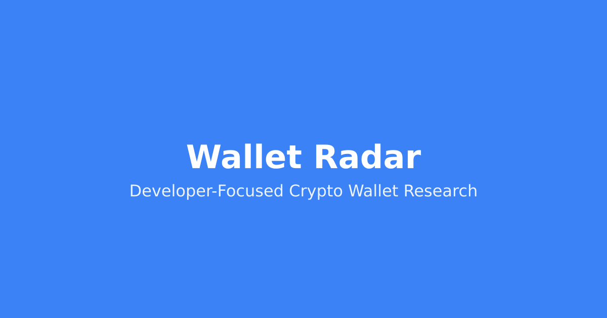
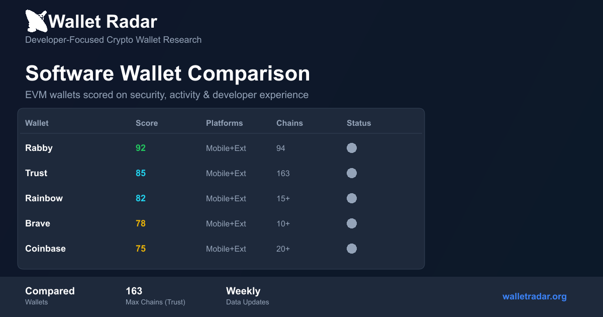
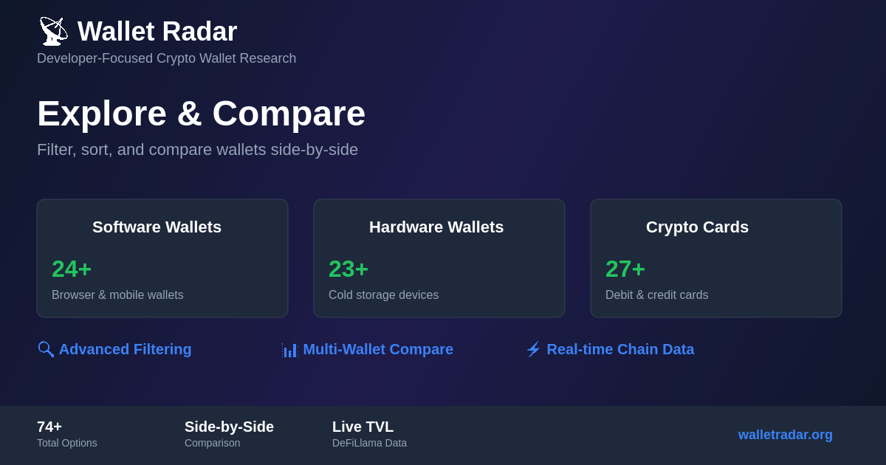

<div align="center">



# Wallet Radar

**Developer-Focused Crypto Wallet Research Platform**

[](https://github.com/chimera-defi/Etc-mono-repo/actions/workflows/wallets-frontend-ci.yml)
[](https://github.com/chimera-defi/Etc-mono-repo/actions/workflows/refresh-wallet-data.yml)
[](LICENSE)
[](https://walletradar.org)

[🌐 Visit Website](https://walletradar.org) • [📊 Compare Wallets](https://walletradar.org/explore) • [📚 Documentation](https://walletradar.org/docs)

</div>

---

## 🎯 What is Wallet Radar?

Wallet Radar is a comprehensive comparison platform designed for developers who need reliable data to choose the right crypto wallet. We track **100+ wallets** across software, hardware, crypto cards, and on/off-ramps with transparent scoring based on security, GitHub activity, developer experience, and real-world usage metrics.

Unlike consumer-focused wallet lists, Wallet Radar provides:
- **📊 Transparent Scoring** — Weighted methodology based on security, activity, and developer experience
- **🔍 GitHub Activity Tracking** — Real-time monitoring of development activity, release frequency, and maintenance status
- **🛡️ Security Audits** — Comprehensive audit history with links to reports
- **👨‍💻 Developer Experience** — Documentation quality, SDK availability, error messages, and integration ease
- **🔗 Multi-Chain Support** — Track which wallets support your target chains
- **⚡ Live Data** — Automated weekly updates via GitHub API

### 📈 What We Compare

| Category | Count | Description |
|----------|-------|-------------|
| **Software Wallets** | 24+ | Browser extensions, mobile apps, desktop wallets |
| **Hardware Wallets** | 23+ | Cold storage devices with security element analysis |
| **Crypto Cards** | 27+ | Crypto-backed credit & debit cards |
| **On/Off-Ramps** | 20+ | Fiat-to-crypto conversion providers |

---

## 🖼️ Product Screenshots

<div align="center">

### Software Wallet Comparison


### Interactive Explorer & Comparison Tool


</div>

---

## ✨ Key Features

### 🔍 **Advanced Filtering & Comparison**
- Filter by platforms (Mobile, Browser, Desktop)
- Filter by features (Transaction Simulation, Scam Alerts, Testnets)
- Filter by license type (Open Source, Source Available, Proprietary)
- Compare up to 4 wallets side-by-side

### 📊 **Comprehensive Scoring System**
- Security features (audits, open source, tx simulation)
- GitHub metrics (stars, issues, release frequency)
- Developer experience (docs, SDKs, support)
- Platform coverage (mobile, browser, desktop)

### 🔄 **Automated Data Updates**
- Weekly GitHub Activity monitoring
- Automated PR creation with updated data
- Manual verification for security-critical changes

### 🎨 **Developer-Friendly Interface**
- Clean, fast Next.js 14 application
- Dark mode support
- Responsive design for all devices
- SEO optimized with structured data

### 🔗 **Live Chain Data Integration**
- Real-time TVL data from DeFiLlama
- Chain support verification
- Network status tracking

---

## 🏗️ Tech Stack

### Frontend
- **Framework:** Next.js 14 (React 18)
- **Styling:** Tailwind CSS 3
- **Icons:** Lucide React
- **Markdown:** react-markdown with GitHub Flavored Markdown
- **Type Safety:** TypeScript 5

### Data Pipeline
- **Data Source:** GitHub REST API, WalletBeat, Rabby API, Trust Registry
- **Automation:** GitHub Actions (weekly refresh)
- **Storage:** Markdown files with frontmatter metadata

### Infrastructure
- **Hosting:** AWS Amplify
- **CI/CD:** GitHub Actions
- **OG Images:** Canvas-based generation with Sharp

---

## 🚀 Getting Started

### Prerequisites
- Node.js 20+
- npm or yarn

### Local Development

```bash
# Clone the repository
git clone https://github.com/chimera-defi/Etc-mono-repo.git
cd Etc-mono-repo/wallets/frontend

# Install dependencies
npm install

# Run development server
npm run dev

# Open http://localhost:3000 in your browser
```

### Build for Production

```bash
# Build the application
npm run build

# Start production server
npm start
```

### Available Scripts

| Script | Description |
|--------|-------------|
| `npm run dev` | Start development server |
| `npm run build` | Build for production |
| `npm start` | Start production server |
| `npm run lint` | Run ESLint |
| `npm run type-check` | Run TypeScript type checking |
| `npm test` | Run smoke tests |
| `npm run generate-og` | Generate OG images |
| `npm run validate-cards` | Validate Twitter cards |

---

## 📁 Project Structure

```
wallets/
├── frontend/               # Next.js application
│   ├── src/
│   │   ├── app/           # Next.js 14 App Router pages
│   │   ├── components/    # React components
│   │   ├── lib/           # Utilities & helpers
│   │   └── styles/        # Global styles
│   ├── public/            # Static assets & OG images
│   ├── scripts/           # Build & validation scripts
│   └── package.json
├── scripts/               # Data refresh automation
│   └── refresh-github-data.sh
├── SOFTWARE_WALLETS.md    # Software wallet comparison table
├── HARDWARE_WALLETS.md    # Hardware wallet comparison table
├── CRYPTO_CARDS.md        # Crypto card comparison table
├── RAMPS.md               # On/off-ramp comparison table
├── *_DETAILS.md           # Detailed analysis documents
├── CHANGELOG.md           # Change history
└── README.md              # This file
```

---

## 📊 Data Sources

All data is sourced from publicly available, verified sources:

| Source | Usage | Links |
|--------|-------|-------|
| **GitHub API** | Stars, issues, release frequency, activity status | [API Docs](https://docs.github.com/en/rest) |
| **WalletBeat** | License info, device support, security audits | [walletbeat.fyi](https://walletbeat.fyi) |
| **Rabby API** | Chain counts for software wallets | [api.rabby.io](https://api.rabby.io/v1/chain/list) |
| **Trust Registry** | Network support data | [GitHub](https://github.com/trustwallet/wallet-core) |
| **DeFiLlama** | Real-time TVL data for chains | [defillama.com](https://defillama.com) |

---

## 🔄 Automated Updates

Wallet data is automatically refreshed every Monday via GitHub Actions:

```bash
# Manual refresh (requires GitHub token)
cd wallets/scripts
./refresh-github-data.sh          # Text output
./refresh-github-data.sh --json   # JSON output
./refresh-github-data.sh --markdown  # Markdown table
```

See [scripts/README.md](./scripts/README.md) for full documentation.

---

## 📚 Documentation

Comprehensive comparison tables and guides:

- **[SOFTWARE_WALLETS.md](./SOFTWARE_WALLETS.md)** — Software wallet comparison (24 EVM wallets)
- **[HARDWARE_WALLETS.md](./HARDWARE_WALLETS.md)** — Hardware wallet comparison (23 devices)
- **[CRYPTO_CARDS.md](./CRYPTO_CARDS.md)** — Crypto credit card comparison (27 cards)
- **[RAMPS.md](./RAMPS.md)** — On/off-ramp provider comparison (20 providers)
- **[CHANGELOG.md](./CHANGELOG.md)** — Complete change history
- **[CONTRIBUTING.md](./CONTRIBUTING.md)** — How to contribute
- **[VERIFICATION_NOTES.md](./VERIFICATION_NOTES.md)** — Data verification methods

---

## 🛡️ Trust & Transparency

### Why We're Not Phishing

✅ **Never ask for passwords** — No login page, no wallet connection, no key requests
✅ **No personal data collection** — No registration, no email required, no user tracking
✅ **Transparent data sources** — All links and data sources verified and documented
✅ **Open source code** — View and audit our code on GitHub
✅ **Published methodology** — All scoring formulas documented and reproducible
✅ **Affiliate disclosures** — Affiliate links, when used, are disclosed and never affect scores

### Educational Purpose Only

Wallet Radar does NOT provide financial advice, recommend specific wallets, or collect personal information. All data is sourced publicly and linked for independent verification. We are completely independent of all wallet providers.

---

## 🤝 Contributing

Contributions are welcome! Here's how you can help:

1. **Report Issues** — Found incorrect data? [Open an issue](https://github.com/chimera-defi/Etc-mono-repo/issues)
2. **Add Wallets** — See [CONTRIBUTING.md](./CONTRIBUTING.md) for guidelines
3. **Improve Documentation** — Fix typos, clarify explanations
4. **Enhance Features** — Submit PRs for new features or improvements

See [CONTRIBUTING.md](./CONTRIBUTING.md) for detailed guidelines.

---

## 📜 License

This project is licensed under the MIT License - see the [LICENSE](LICENSE) file for details.

---

## 🔗 Links

- **Website:** [walletradar.org](https://walletradar.org)
- **GitHub:** [github.com/chimera-defi/Etc-mono-repo/tree/main/wallets](https://github.com/chimera-defi/Etc-mono-repo/tree/main/wallets)
- **Issues:** [github.com/chimera-defi/Etc-mono-repo/issues](https://github.com/chimera-defi/Etc-mono-repo/issues)

---

<div align="center">

**Built with ❤️ for the developer community**

[⬆ Back to Top](#wallet-radar)

</div>
